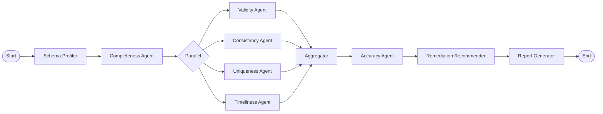

# AgentDQ — Agentic Data Quality Assessment for SAP Master Data

AgentDQ is a multi-agent system that autonomously assesses data quality across SAP master data entities. Six specialist agents — one per DAMA data quality dimension — are coordinated by a LangGraph orchestrator to produce a consolidated DQ scorecard with prioritised remediation recommendations.

The project targets asset-intensive industries (oil & gas, utilities, manufacturing) by focusing on two core SAP master data domains: **Material Master** (with plant and storage location data) and **Equipment Master**.

## Architecture



### Agent-to-Dimension Mapping

| Agent         | DAMA Dimension | Approach                                                    |
|---------------|----------------|-------------------------------------------------------------|
| Completeness  | Completeness   | Mandatory field population checks, conditional by type      |
| Validity      | Validity       | Domain value and format rule validation                     |
| Consistency   | Consistency    | Cross-table and intra-record logical coherence              |
| Accuracy      | Accuracy       | LLM-based classification + external reference verification  |
| Timeliness    | Timeliness     | Record staleness and temporal validity analysis             |
| Uniqueness    | Uniqueness     | Fuzzy matching + LLM adjudication for duplicate detection   |

## Data Scope

**Material Master:** MARA (general), MARC (plant-level), MARD (storage location), MAKT (descriptions)

**Equipment Master:** EQUI (equipment), EQKT (descriptions), EQUZ (time segments), IFLOT (functional locations)

Cross-entity linkages between equipment and material master records provide the consistency checks relevant to asset-intensive operations.

## Technology Stack (Phase 1 — Open Source Pilot)

| Component              | Technology                                      |
|------------------------|------------------------------------------------|
| Orchestration          | LangGraph (StateGraph)                         |
| LLM prompting          | DSPy (signatures + optimisation)               |
| LLM backend            | Claude API (primary), local Ollama (fallback)  |
| Experiment tracking    | MLflow                                         |
| Data generation        | Python (Faker + custom SAP schema module)      |
| Fuzzy matching         | rapidfuzz, sentence-transformers               |
| Data profiling         | pandas, Great Expectations                     |
| Storage                | DuckDB or SQLite (local)                       |
| Reporting              | Structured JSON + Markdown/HTML scorecard      |
| Version control        | Git + DVC (for dataset versioning)             |

## Getting Started

### Prerequisites

- Python 3.11+
- An Anthropic API key (for Claude API access)

### Installation

```bash
git clone https://github.com/<your-username>/agentdq.git
cd agentdq
pip install -e .
```

### Configuration

```bash
cp .env.example .env
# Edit .env with your API keys
```

### Running the Pipeline

```bash
# Generate synthetic test data
python -m src.data.generator --scenario degraded --records 5000

# Run the full DQ assessment
python -m src.orchestrator --input data/synthetic/degraded_5000.parquet
```

## Project Structure

```
agentdq/
+-- config/
|   +-- schema/          # SAP table field definitions (YAML)
|   +-- rules/           # Validation, consistency, completeness rules
|   +-- settings.yaml    # Global configuration
+-- src/
|   +-- agents/          # Six specialist DQ agents + base class
|   +-- dspy_modules/    # DSPy signatures and evaluation metrics
|   +-- data/            # Data loading, generation, defect injection
|   +-- matching/        # Fuzzy matching utilities
|   +-- reporting/       # Scorecard computation and rendering
|   +-- utils/           # Logging, MLflow helpers
|   +-- state.py         # LangGraph state schema
|   +-- orchestrator.py  # LangGraph StateGraph definition
+-- data/                # Raw, synthetic, and ground truth datasets
+-- notebooks/           # EDA and evaluation notebooks
+-- tests/               # Per-agent unit tests
+-- docs/                # Project plan and documentation
```

## Evaluation Methodology

Synthetic datasets are generated with controlled defect injection at known rates per dimension. Each defect is logged with its exact location (table, record, field) and dimension, enabling precision/recall/F1 measurement per agent. Three scenario variants (healthy, degraded, critical) test agent performance across different data quality maturity levels.

All experiments are tracked in MLflow for reproducibility and comparison.

## Phase 2 — Enterprise (SAP BDC)

Phase 2 migrates the same agent architecture onto SAP Business Data Cloud: Datasphere for the data layer, SAP AI Core for LLM serving, and SAP Analytics Cloud for reporting. The agents and their logic remain unchanged; only the data access and LLM invocation plumbing is replaced.

See `docs/PROJECT_PLAN.md` for the full project plan and architecture details.

## Licence

This project is for portfolio and educational purposes.

## Author

<!-- Replace with your details -->
[Your Name](https://github.com/<your-username>)
