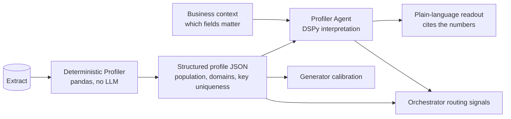
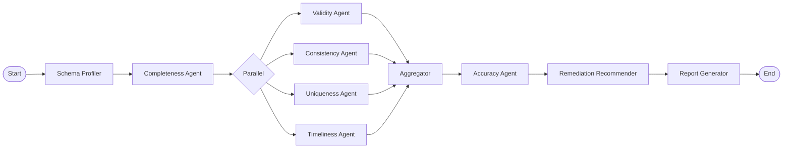
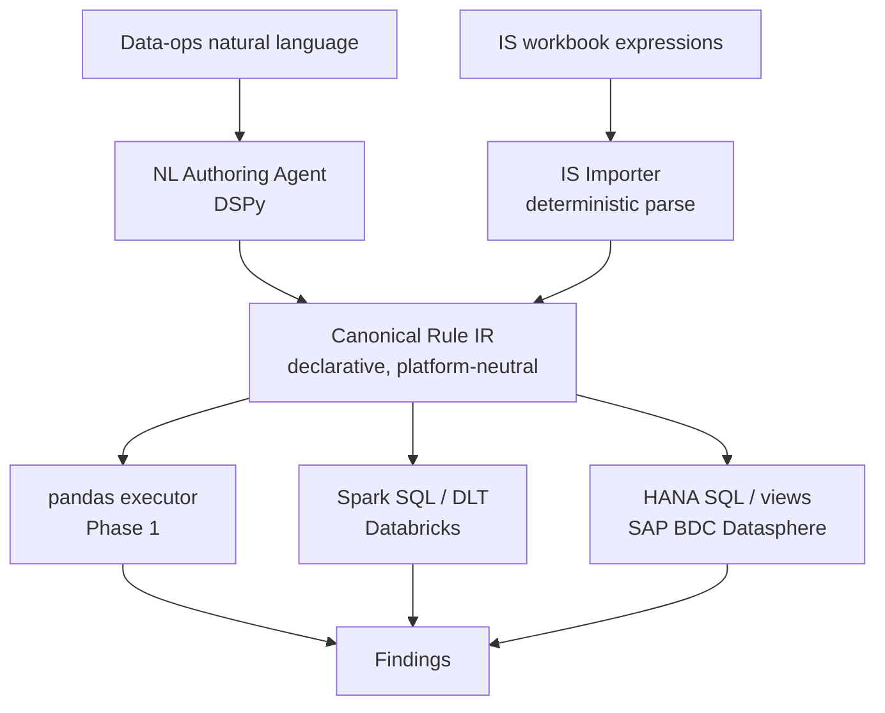

# AgentDQ — Agentic Data Quality Assessment for SAP Master Data

## Project Overview

AgentDQ is a multi-agent system that autonomously assesses data quality across SAP master data entities, aligned to the six DAMA data quality dimensions: Completeness, Validity, Consistency, Accuracy, Timeliness, and Uniqueness. Each dimension is handled by a specialist agent, coordinated by a LangGraph orchestrator that produces a consolidated DQ scorecard.

The project targets asset-intensive industries (oil & gas, utilities, manufacturing) by focusing on two core SAP master data domains: Material Master (with plant and storage location data) and Equipment Master.

### Why This Project

- Demonstrates **agent architecture design** — not single-shot LLM calls
- Applies **domain expertise** (SAP MDG) to a real enterprise problem
- Uses **rigorous evaluation methodology** — ground truth labels, precision/recall per dimension, MLflow tracking
- Bridges **open-source and enterprise platforms** (Phase 1 → Phase 2 progression)
- Differentiates from typical ML portfolios by combining AI/ML skills with deep enterprise data management knowledge

### Two-Phase Approach

- **Phase 1 (Pilot):** Open-source technology stack, synthetic + SAP sandbox data
- **Phase 2 (Enterprise):** SAP Business Data Cloud (BDC) as the data and AI platform

---

## Agent Architecture

### Agent-to-Dimension Mapping

Six specialist agents, one per DAMA dimension, plus an orchestrator and a reporter:

**Orchestrator (LangGraph StateGraph)** — Routes execution, manages shared state, applies conditional logic (e.g., if completeness is below threshold, deprioritise uniqueness), aggregates dimension scores into a composite DQ scorecard.

**Agent 1 — Completeness** — Measures population of mandatory and conditionally mandatory fields. For MARA: is MATKL (material group) populated for all active materials? For BUT000: do all partners with role FLCU00 (customer) have an ADRC address record? This agent understands which fields are mandatory *per material type or partner role*, not just globally — a raw material doesn't need a BOM, but a finished good does.

**Agent 2 — Validity** — Checks whether populated values conform to their permitted domains and format rules. MARA-MEINS against the ISO unit of measure table (T006). ADRC-POST_CODE against country-specific postal code patterns. BUT000-BU_SORT1 (search term) against naming conventions. Phone numbers in ADRC-TEL_NUMBER against E.164 format. This is the rules engine agent — it maintains or dynamically loads a validation rule set per field.

**Agent 3 — Consistency** — Cross-table and intra-record logical coherence. Does MARC-BESKZ (procurement type) align with MARA-MTART (material type)? If a material is externally procured, does it have a valid purchasing info record? Does the country in BUT000-LAND1 match the country derived from ADRC-POST_CODE? If a business partner has role FLVN00 (vendor) and FLCU00 (customer), are the addresses consistent? This agent requires entity-relationship knowledge of the SAP data model.

**Agent 4 — Accuracy** — The hardest dimension. Accuracy means "does the value reflect the real-world truth?" Approximated by: cross-referencing company names against ACRA's public registry (UEN lookup), validating postal codes against OneMap API, checking whether material descriptions match their material group classification (an LLM judgement call — does "Hex Bolt M8 Stainless" belong in material group "Fasteners"?). This is where DSPy shines — define a signature like `MaterialDescription, MaterialGroup, MaterialType -> AccuracyAssessment, Confidence, Reasoning` and optimise it.

**Agent 5 — Timeliness** — Record currency and staleness. Materials with MARA-ERSDA (creation date) older than five years and no change document (CDHDR/CDPOS) entries in the last two years. Business partners created during initial migration (identifiable by creation date clustering) never subsequently maintained. Price conditions in KONP past their validity end date but still flagged as active. This agent needs temporal metadata — creation dates, last change dates, validity periods.

**Agent 6 — Uniqueness** — Duplicate and near-duplicate detection. For business partners: fuzzy matching on name (BUT000-NAME_ORG1/2) + address (ADRC) using Jaro-Winkler or embedding similarity. For materials: similar MAKTX descriptions with different material numbers, potentially across plants. Produces candidate duplicate clusters with a confidence score, not binary yes/no. The LLM serves as a second-pass adjudicator on borderline cases — "Are 'ACME Corp' and 'ACME Corporation Pte Ltd' the same entity given these addresses?"

**Reporter — Remediation Recommender** — Consumes the structured findings from all six agents, prioritises by business impact (a completeness gap in safety-critical material fields outranks a formatting issue in search terms), and generates a structured remediation report. This is a DSPy pipeline: `DimensionFindings, MaterialType, BusinessContext -> PrioritisedRemediations, ExecutiveSummary`.

### Profiling: Deterministic Measurement, Agentic Interpretation

A deliberate separation runs through the profiling stage, and it is the template every downstream dimension agent follows: deterministic measurement first, language-model interpretation second. Profiling answers "what does the data look like?"; interpretation answers "so what, and who should care?". The two are different jobs and are kept in different layers.

**Deterministic profiler (the evidence layer).** A pandas-based module computes the facts: per-field population rates, distinct counts, inferred domains, value-length ranges, a coarse type hint, and composite-key uniqueness (one row per material per plant in MARC, per plant and storage location in MARD). It is fast, free, fully reproducible, and emits structured JSON. It never uses a language model — arithmetic and counting are not tasks to delegate to an LLM. This layer is the single source of truth that everything else cites.

**Profiler Agent (the interpretation layer).** A DSPy module sits on top of that JSON and turns it into a narrative for a non-technical data-operations audience. It interprets; it does not measure. A representative signature is:

```
TableProfile, BusinessContext -> HealthSummary, Concerns, PlainLanguageReadout
```

So "EKGRP populated 73.83%, MATKL 96.14%, MMSTD 99.97% sentinel" becomes "Purchasing groups are missing on roughly a quarter of plant records, which will block automated procurement for those materials. Material groups are in good shape. Most plant-status dates are empty, which is normal for active materials."

Two principles govern the agent:

- **It cites the numbers it reasons from.** Every claim is anchored to a figure in the deterministic profile rather than free-narrated. This keeps the readout honest and auditable, which a data-operations audience needs in order to trust and act on it.
- **Severity reflects business impact, not raw percentage.** A 5% gap in a safety-relevant field outranks a 30% gap in a cosmetic one. The agent therefore takes a small amount of domain context about which fields matter as an input, supplied from SAP knowledge, rather than ranking issues by magnitude alone.

The separation earns its keep three ways. The numbers stay trustworthy because no language model computes them. The narrative is cheap to regenerate and easy to tune per audience — the same JSON can yield a technical readout, a data-operations summary and an executive paragraph from three different signatures, with no change to the evidence layer. And it is a low-risk rehearsal of the exact pattern the six dimension agents use, letting the DSPy and MLflow plumbing be proven out before the dimension logic gets complicated.



This "deterministic findings in, judgement out" contract is the shape of every dimension agent that follows: a deterministic core establishes verifiable findings, and a language-model layer interprets, prioritises and explains them while citing that evidence. The raw profile always remains available for anyone who wants the underlying numbers.

### Execution Flow



Conditional edges apply — for instance, if the Completeness Agent finds the table is less than 70% complete, the Uniqueness Agent gets deprioritised (no point finding duplicates in sparse data), and the Remediation Recommender is told to flag completeness as the primary concern.

---

---

## Rules Ingestion and Authoring

Rules are not hard-coded in the agents. They are declarative artefacts that enter the system, are validated against the schema, and are compiled to whichever engine runs them. How rules are authored determines whether Phase 2 is a recompile or a rewrite, so the design treats authoring as platform-neutral and execution as a compiler target.

### Two front-ends, one representation, many back-ends

Rules arrive two ways, and both converge on a single canonical representation:

- the **IS importer**, which bulk-seeds the legacy Information Steward rules (roughly 1,600 rules) by deterministic parsing; and
- the **natural-language authoring agent**, through which a data-operations user writes a new rule in English and the agent interprets it into a formal rule.

Both emit one **canonical rule representation (IR)**: a declarative, platform-neutral specification. The IR is then compiled to the execution engine — pandas in Phase 1, Spark SQL on Databricks or HANA SQL on SAP BDC in Phase 2.



### Emit IR, not code

The system never asks a language model to write executable Python or SQL. The IR is a declarative description of the check — a small typed predicate tree — and a deterministic compiler turns it into code. This buys four properties, each of which matters most in Phase 2:

```
Property         Why it matters
---------------  ---------------------------------------------------------
Safe             No model-authored code runs against the warehouse; the IR
                 is validated before anything executes.
Portable         One IR compiles to pandas, Spark SQL or HANA SQL. The rule
                 outlives the platform.
Validatable      Field names, types and domains are checked against the
                 schema before a rule runs. Hallucinated fields are
                 rejected, not executed.
Pushdown         The IR compiles to SQL that runs in Databricks or
                 Datasphere, so checks execute where the data lives rather
                 than pulling rows to the client. This is what scales.
```

In Phase 1 the pandas executor pulls data to the desktop. In Phase 2 that is not viable, so the IR compiles to SQL that executes in place. The agent and the IR are unchanged; only the compiler differs.

### The predicate: one structure, three roles

A single small **predicate** type is reused throughout. A predicate is either a comparison (`{field, op, value}`, with operators such as `in`, `is_not_null`, `gt`, `matches`) or a boolean node (`and`, `or`, `not`, `implies` over child predicates). The same structure serves three roles:

```
Role         In the RuleSpec    What it expresses
-----------  -----------------  ------------------------------------------
scope        scope              which rows the rule applies to  (a filter)
condition    assertion (when)   the antecedent of a cross-field rule
assertion    assertion (then)   what must hold for in-scope rows
```

A scoped cross-field rule then reads cleanly:

```
rule:   max-stock required for reorder-point planning
table:  MARC
scope:      LVORM is_null                 # only non-deleted plant records
assertion:  implies(
              DISMM in ['VB', 'ZB'],      # when reorder-point MRP type
              MABST is_not_null )         # then max stock must be set
meta:   dimension=Consistency, archetype=cross_field, severity=High
```

Evaluation semantics are uniform across every archetype, which keeps the executor simple:

```
in_scope  = scope is None OR eval(scope, row) is True
violated  = in_scope AND NOT eval(assertion, row)
```

A not-null rule is `assertion = {field, is_not_null}` with no scope; a domain rule is `assertion = {field, in, domain_values}`. One model expresses every rule.

### Scope filters as a first-class concept

Scope is a first-class part of the spec, not an afterthought, because it is the single biggest lever for high-volume data. The scope predicate compiles directly to a SQL `WHERE` clause, so a check only ever scans the rows it cares about. "Reorder-point rule for active FERT materials in three plants" might touch a fraction of a percent of a billion-row table rather than all of it. Scope filter equals pushdown equals cost saved, and it reuses the same predicate machinery the cross-field rules already need.

For the first cut, scope predicates reference the rule's **own table** (single-table filter). Cross-table scope — for example "apply to MARC rows whose MARA-MTART is FERT" — requires join machinery and is deferred to the same extension that introduces cross-table consistency rules generally. Same-table scope covers the large majority of real filters.

### The natural-language authoring agent

A DSPy module, not a prompt string, with a signature along the lines of:

```
rule_text, table_schema, existing_rules -> rule_spec, dimension, archetype, rationale
```

The design points that make it trustworthy for a non-technical author:

- **Grounded in the schema.** The agent receives the table's fields, types, domains and keys, so it binds to real columns and any reference to a non-existent field is rejected. This reuses the schema layer.
- **Emits a typed RuleSpec, not free text.** DSPy produces a validated object directly, so the output is structurally constrained by construction.
- **Explain-back and dry-run before saving.** The agent compiles the proposed IR with the Phase-1 executor, runs it against the current dataset, and shows the user a plain-language paraphrase plus an impact preview ("this would flag 412 of 5,000 MARC rows; here are five examples"). The user confirms or corrects. This closes the loop between intent and interpretation and resolves the ambiguity natural language always carries.
- **Classifies dimension and archetype** with the same mapping logic the importer uses, and **stores the original natural-language text as provenance**, mirroring how the IS expression is retained for lineage.

### The IS workbook as gold set

The IS workbook is more than a seed catalogue. Each rule pairs a natural-language description with its formal expression, so once the importer has produced IR, the result is a set of roughly 1,600 `(natural language -> formal rule)` pairs. That is the labelled set used to optimise the authoring agent with DSPy and to score it in MLflow. Building the importer first is therefore doubly justified: it seeds the catalogue and it produces the evaluation set for the agent.

### Phase 2 portability, concretely

Only the bottom layer changes between phases:

```
Concern            Phase 1                  Phase 2
-----------------  -----------------------  ------------------------------
Execution          pandas executor          SQL compiler (Spark / HANA),
                                             via a transpiler such as
                                             SQLGlot for dialect targets
Authoring LLM      OpenAI API               SAP AI Core (GenAI Hub) or
                                             Databricks model serving;
                                             a DSPy config change
Rule repository    git-tracked YAML         governed table (Delta or
                                             Datasphere) with a lifecycle:
                                             draft -> approved -> active
```

Author, natural-language origin, dry-run statistics and timestamp travel with each rule for audit.

### Relationship to the current contracts

The `Rule` contract already carries dimension, archetype, domain values and provenance, and covers the simple archetypes (not-null, domain-in) directly. The one evolution required is to add the **predicate tree** for the compositional cases — scope filters and cross-field `when/then` with `and`/`or`/`not`/`implies` — so the IR can express the richer rules. This is an extension of the existing contract rather than a new concept.

---

## Data Scope

### Material Master Tables

| Table | Purpose                        | Key Fields for DQ                              |
|-------|--------------------------------|-------------------------------------------------|
| MARA  | General material data          | MATNR, MTART, MATKL, MEINS, MBRSH, BISMT       |
| MARC  | Plant-level data               | MATNR, WERKS, BESKZ, DISMM, DISPO, EKGRP       |
| MARD  | Storage location data          | MATNR, WERKS, LGORT, LABST, INSME               |
| MAKT  | Material descriptions          | MATNR, SPRAS, MAKTX                             |

### Equipment Master Tables

| Table | Purpose                        | Key Fields for DQ                              |
|-------|--------------------------------|-------------------------------------------------|
| EQUI  | Equipment master               | EQUNR, EQTYP, EQART, HERST, SERGE, BAESSION    |
| EQKT  | Equipment descriptions         | EQUNR, SPRAS, EQKTX                             |
| EQUZ  | Equipment time segment         | EQUNR, DATBI, DATAB, IWERK, STORT, MATNR        |
| IFLOT | Functional locations           | TPLNR, FLTYP, IWERK, STORT                      |

### Cross-Entity Linkages

These are where the Consistency Agent gets interesting:

- **EQUZ-MATNR → MARA:** Equipment linked to its material master record — does that material actually exist?
- **EQUZ-IWERK/STORT → MARC/MARD:** Equipment plant/storage location should correspond to valid plant/storage location combinations in material master
- **EQUZ-TPLNR → IFLOT:** Equipment assigned to a functional location — does that functional location's plant match the equipment's maintenance plant?
- **MARA-MTART = ERSA (spare parts) referenced by equipment:** Are spare parts stocked in the same plant (MARD record exists)?

---

## Data Strategy

### Combined Approach: SAP CAL Extraction + Controlled Synthetic Generation

#### Step 1 — Extract Reference Distributions from SAP CAL

Spin up an S/4HANA Fully-Activated Appliance on SAP Cloud Appliance Library (https://www.sap.com/sea/products/technology-platform/cloud-appliance-library.html). These come pre-loaded with realistic master data across multiple company codes and plants. Export the relevant tables as CSVs via SE16N or via CDS views / OData.

The purpose is not to use this data directly as the test set — it is to extract **realistic distributions**: what percentage of materials are FERT vs ROH vs HALB, what's the typical completeness profile of each field, what do real SAP material descriptions look like, how are equipment types distributed. These distributions calibrate the synthetic generator so it produces data that *looks* like a real SAP system, not random noise.

#### Step 2 — Build the Synthetic Generator with Controlled Defect Injection

The generator takes those distributions and produces datasets at configurable scale (1,000 to 100,000+ records) with defects injected at known rates per dimension. This is the ground truth factory:

- **Completeness defects:** Null out mandatory fields at rate $r_c$ (e.g., 5%). Vary by field importance — higher rate for low-criticality fields, lower for high-criticality.
- **Validity defects:** Insert out-of-domain values at rate $r_v$. Wrong UoM codes, malformed postal codes, invalid material type codes.
- **Consistency defects:** Create cross-table contradictions at rate $r_{con}$. Material typed as FERT but procurement type set to external with no purchasing info record.
- **Accuracy defects:** Swap material descriptions between material groups at rate $r_a$. A "Hex Bolt" classified under "Lubricants."
- **Timeliness defects:** Backdate creation dates and remove change logs at rate $r_t$. Create expired-but-active conditions.
- **Uniqueness defects:** Generate near-duplicate clusters at rate $r_u$. Same company, slightly different name spelling, same or nearby address.

Each injected defect is logged with its exact location (table, record ID, field) and dimension. This gives precision/recall/F1 per agent per dimension — proper quantitative evaluation, not just "it found some issues."

#### Step 3 — Generate Multiple Test Scenarios

Create at least three dataset variants:

- **Healthy:** Low defect rates (~1-2% per dimension)
- **Degraded:** Moderate defect rates (~5-8%)
- **Critical:** High defect rates (~15-20%)

This allows evaluation of how each agent performs across different data quality maturity levels and whether the orchestrator's conditional logic adapts correctly. Running agents against *clean* data also measures false positive rates.

---

## Phase 1 — Pilot (Open Source Stack)

### Objective

Prove the architecture works, establish benchmark scores, publish as a portfolio piece.

### Technology Stack

| Component              | Technology                                      |
|------------------------|------------------------------------------------|
| Orchestration          | LangGraph (StateGraph)                         |
| LLM prompting          | DSPy (signatures + optimisation)               |
| LLM backend            | Claude API (primary), local Ollama (fallback)  |
| Experiment tracking    | MLflow                                         |
| Data generation        | Python (Faker + custom SAP schema module)      |
| Fuzzy matching         | rapidfuzz, sentence-transformers               |
| Data profiling         | pandas, Great Expectations                     |
| Storage                | DuckDB or SQLite (local)                       |
| Reporting              | Structured JSON + Markdown/HTML scorecard      |
| Version control        | Git + DVC (for dataset versioning)             |

### GPU Requirements

**No GPU required for Phase 1.** LLM calls go to Claude API. Fuzzy matching uses CPU-friendly algorithms. sentence-transformers for embedding-based duplicate detection runs fine on CPU with a small model (all-MiniLM-L6-v2). MLflow is pure infrastructure. The entire Phase 1 runs on a Windows desktop with a 4070 Ti.

### Project Scaffold

```
agentdq/
|
+-- README.md
+-- pyproject.toml                  # project metadata + dependencies
+-- .env.example                    # API keys template (never commit .env)
+-- .gitignore
|
+-- config/
|   +-- schema/
|   |   +-- mara.yaml               # field definitions, domains, mandatory rules
|   |   +-- marc.yaml
|   |   +-- mard.yaml
|   |   +-- makt.yaml
|   |   +-- equi.yaml
|   |   +-- eqkt.yaml
|   |   +-- equz.yaml
|   |   +-- iflot.yaml
|   +-- rules/
|   |   +-- validity_rules.yaml     # format patterns, domain value lists
|   |   +-- consistency_rules.yaml  # cross-table logical rules
|   |   +-- completeness_rules.yaml # mandatory field definitions per type
|   +-- settings.yaml               # global config: LLM model, thresholds, MLflow URI
|
+-- src/
|   +-- __init__.py
|   +-- state.py                    # LangGraph state schema (TypedDict)
|   +-- orchestrator.py             # StateGraph definition, nodes, edges
|   +-- agents/
|   |   +-- __init__.py
|   |   +-- base.py                 # abstract base agent class
|   |   +-- completeness.py
|   |   +-- validity.py
|   |   +-- consistency.py
|   |   +-- accuracy.py
|   |   +-- timeliness.py
|   |   +-- uniqueness.py
|   +-- dspy_modules/
|   |   +-- __init__.py
|   |   +-- signatures.py           # DSPy signatures for LLM-based agents
|   |   +-- metrics.py              # evaluation metrics for DSPy optimisation
|   +-- data/
|   |   +-- __init__.py
|   |   +-- loader.py               # load CSVs/parquet into unified format
|   |   +-- generator.py            # synthetic data generator
|   |   +-- defect_injector.py      # controlled defect injection with labels
|   +-- matching/
|   |   +-- __init__.py
|   |   +-- fuzzy.py                # fuzzy matching utilities for uniqueness
|   +-- reporting/
|   |   +-- __init__.py
|   |   +-- scorecard.py            # DQ scorecard computation
|   |   +-- renderer.py             # HTML/Markdown report generation
|   +-- utils/
|       +-- __init__.py
|       +-- logging.py              # structured logging setup
|       +-- mlflow_utils.py         # MLflow experiment helpers
|
+-- data/
|   +-- raw/                        # extracted SAP CAL data (gitignored)
|   +-- synthetic/                  # generated datasets (gitignored)
|   +-- ground_truth/               # defect labels (tracked in DVC)
|   +-- .gitkeep
|
+-- notebooks/
|   +-- 01_data_profiling.ipynb     # EDA on SAP CAL extracts
|   +-- 02_agent_evaluation.ipynb   # per-agent analysis and MLflow review
|
+-- tests/
|   +-- __init__.py
|   +-- test_completeness.py
|   +-- test_validity.py
|   +-- test_consistency.py
|   +-- test_accuracy.py
|   +-- test_timeliness.py
|   +-- test_uniqueness.py
|
+-- mlruns/                         # MLflow local tracking (gitignored)
+-- dvc.yaml                        # DVC pipeline definitions
```

### Timeline (~9 weeks at 8-10 hours/week)

#### Week 1-2: Data Foundation
- Extract tables from SAP sandbox via SE16N or CDS views
- Exploratory profiling — understand the distributions, field population rates, common patterns
- Build the synthetic generator module calibrated to those distributions
- Define the defect injection catalogue (what defects, per which fields, per which dimension)
- **Deliverable:** Working generator that produces labelled datasets on demand

#### Week 3-5: Agent Development (individual agents)
- Build agents one at a time, starting with the most straightforward
- Recommended order: Completeness → Validity → Timeliness → Consistency → Uniqueness → Accuracy
- Completeness and Validity are rule-based and fast to build — both done in week 3
- Consistency needs the cross-entity logic — allow a full week
- Uniqueness needs the fuzzy matching pipeline — allow a full week
- Accuracy is the LLM-heavy agent — build last, once comfortable with DSPy signatures in this context
- Each agent unit-tested against synthetic data with known defects, results logged to MLflow
- **Deliverable:** Six working agents with individual precision/recall/F1 scores

#### Week 6-7: Orchestration
- Wire all agents into LangGraph StateGraph
- Implement the conditional routing (e.g., skip uniqueness if completeness is below threshold)
- Build the state schema that accumulates findings across agents
- End-to-end pipeline: dataset in → DQ scorecard out
- Integration testing across the three scenario variants (healthy, degraded, critical)
- **Deliverable:** End-to-end pipeline producing DQ scorecards

#### Week 8: DSPy Optimisation + Evaluation
- Run DSPy optimisation for the Accuracy and Uniqueness agents (the two where LLM judgement matters most)
- Full evaluation run: precision/recall/F1 per agent per dimension per scenario
- MLflow comparison of optimised vs baseline prompts
- **Deliverable:** Optimised agents with before/after comparison

#### Week 9: Reporting + Documentation
- Build the scorecard output (structured JSON + rendered HTML/Markdown report)
- Write up the project — architecture, methodology, results
- Clean up the repo for portfolio presentation
- **Deliverable:** Polished repository and documentation

**Critical path item:** Weeks 1-2 (data foundation). Everything downstream depends on having the synthetic generator with properly calibrated distributions and a clean defect injection framework.

**Tip:** Don't wait until week 6 to touch LangGraph. In week 1, spend an hour or two running through the LangGraph tutorials to get familiar with StateGraph, nodes, and edges. That way when orchestration starts in week 6, you're wiring together agents you know into a framework you've already explored.

---

## Phase 2 — Enterprise (SAP BDC)

### Objective

Demonstrate the same capability running on SAP's native infrastructure, proving enterprise deployability.

### Technology Migration

| Phase 1 (Open Source)       | Phase 2 (BDC)                                   |
|-----------------------------|------------------------------------------------|
| Local CSV/DuckDB            | SAP Datasphere (data layer)                    |
| Claude API direct           | SAP AI Core (LLM serving via GenAI Hub)        |
| LangGraph local             | LangGraph on SAP AI Core or BTP Kyma           |
| Markdown/HTML report        | SAP Analytics Cloud dashboard                  |
| Great Expectations          | Datasphere DQ monitoring (where available)     |
| DVC                         | Datasphere data flows for lineage              |

### Key Architectural Decisions

The agents themselves are largely unchanged — DSPy signatures, validation logic, fuzzy matching. What changes is the plumbing: how agents access data (Datasphere CDS views via OData instead of pandas reading CSVs) and how they invoke LLMs (SAP AI Core LM class instead of direct API calls). The orchestration could remain LangGraph deployed as a container on Kyma, or explore SAP AI Launchpad's workflow capabilities if they've matured.

BDC's DQ tooling is still maturing. Phase 2 is partly a "proof of what BDC *could* enable" and partly an exercise in working around its current gaps. This is a strong narrative — "here's the open-source version that works today, and here's how it maps onto SAP's roadmap."

---

## Development Workflow

### What to Write Hands-on (with Claude as reviewer)

- **LangGraph orchestrator** — state schema, node definitions, edge routing, conditional logic. This is the architectural core.
- **DSPy signatures and metric functions** for the Accuracy and Uniqueness agents.
- **Cross-entity consistency rules** — the domain logic that codifies SAP data model knowledge.

### What to Co-develop (write first, then get review)

- **Individual agent logic** — write the first version of each agent, get code review for edge cases, better patterns, and challenged assumptions.
- **Evaluation framework** — MLflow experiment structure and precision/recall calculation.

### What to Delegate (pure plumbing)

- **Synthetic data generator** — Faker configurations, distribution sampling, CSV output formatting. Specify *what* defects and at what rates; the code is mechanical.
- **Data loading utilities**, schema definitions, config files.
- **HTML/Markdown report templates**.

---

## References

- SAP Cloud Appliance Library: https://www.sap.com/sea/products/technology-platform/cloud-appliance-library.html
- LangGraph documentation: https://langchain-ai.github.io/langgraph/
- DSPy documentation: https://dspy-docs.vercel.app/
- MLflow documentation: https://mlflow.org/docs/latest/index.html
