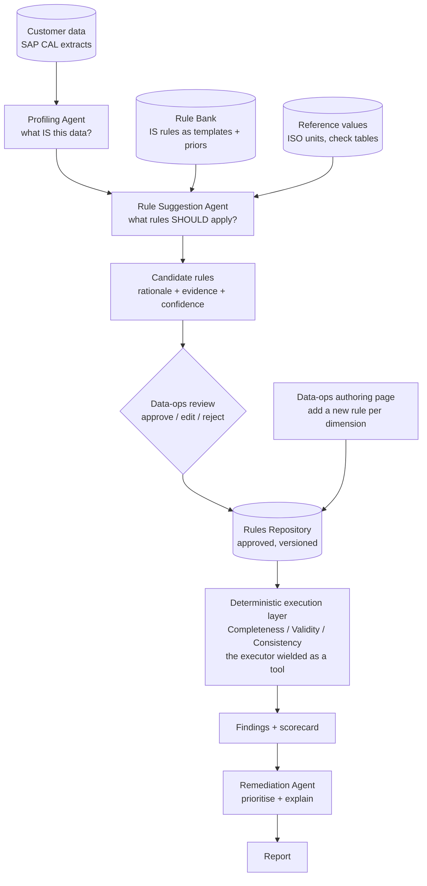
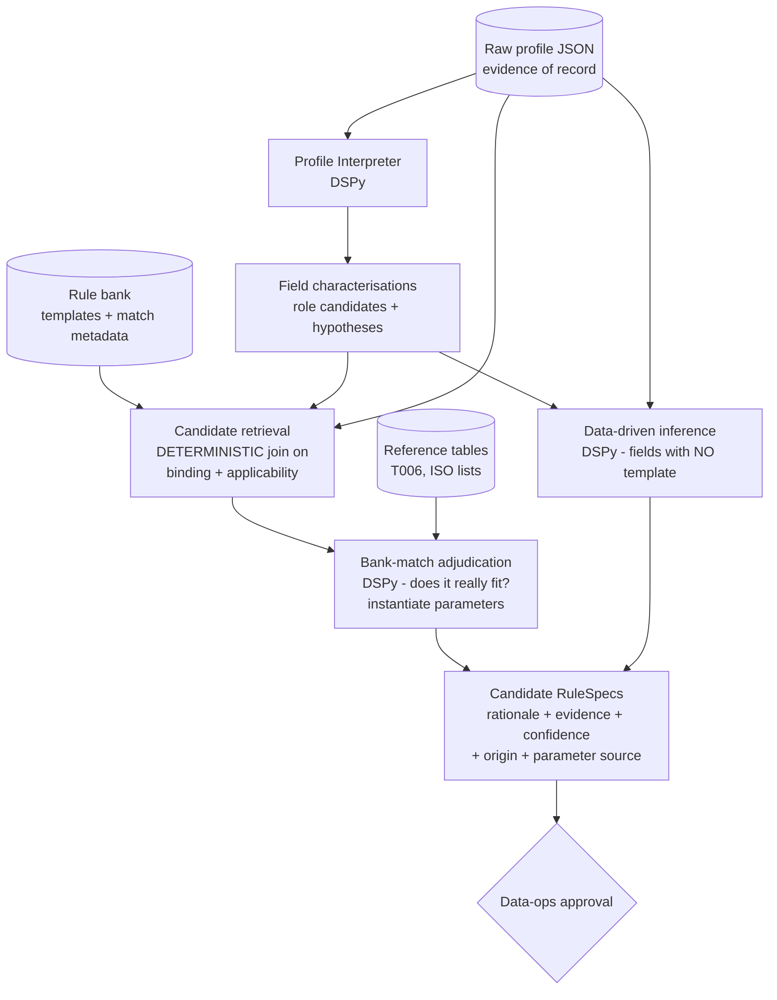
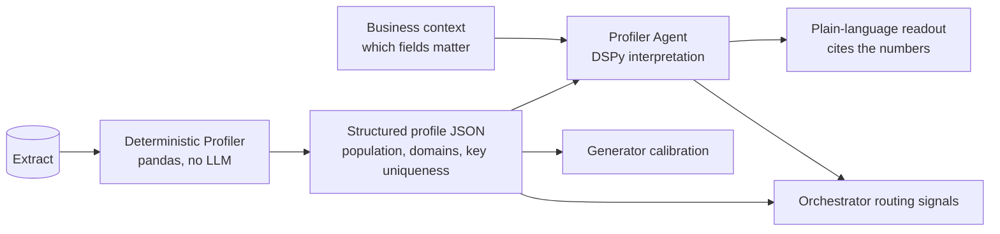
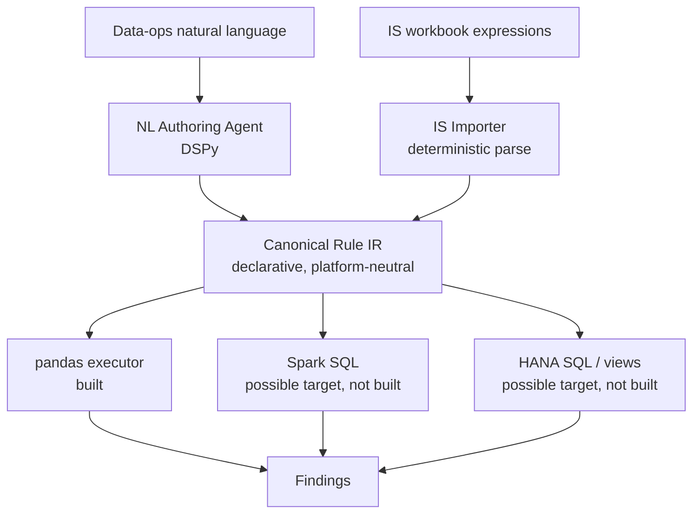
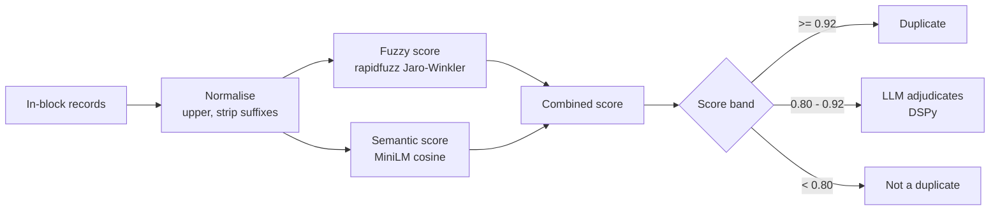

# AgentDQ - Agentic Data Quality Assessment for SAP Master Data

## Project Overview

AgentDQ is a multi-agent system that autonomously assesses data quality across SAP master data entities, aligned to the six DAMA data quality dimensions: Completeness, Validity, Consistency, Accuracy, Timeliness, and Uniqueness. Each dimension is handled by a specialist agent, coordinated by a LangGraph orchestrator that produces a consolidated DQ scorecard.

The project targets asset-intensive industries (oil & gas, utilities, manufacturing) by focusing on two core SAP master data domains: Material Master (with plant and storage location data) and Equipment Master.

### Why This Project

- Demonstrates **agent architecture design** - not single-shot LLM calls
- Applies **domain expertise** (SAP MDG) to a real enterprise problem
- Uses **rigorous evaluation methodology** - ground truth labels, precision/recall per dimension, MLflow tracking
- Treats **portability as a design property** - rules are described declaratively, so the checks are not welded to one runtime
- Differentiates from typical ML portfolios by combining AI/ML skills with deep enterprise data management knowledge

### Scope

AgentDQ is a proof of concept and a portfolio piece. It runs on an open-source
stack against synthetic data and real SAP CAL sandbox extracts, and it stays
there.

Re-platforming onto SAP Business Data Cloud was considered early on and is now
**out of scope for this POC**. SAP intends Reltio, once integrated into BDC, to
serve as the data quality and profiling solution, so there is no case for
building a parallel one on that platform. What survives that decision is the
design property rather than the roadmap: rules are described declaratively
instead of written as runtime code, so they could in principle be compiled to
another engine. That claim is untested here and is stated as a property of the
design, not as a plan.

---

## Build Status

**Delivery status (05-Aug-2026): Packages 1, 2 and 3 complete; Package 4 in
build - five of eight steps done (4a to 4e).** The agentic loop closes end to
end: an agent suggests a rule, a human governs it at the approval gate, and the
approved rule is executable, orchestrated as two LangGraph graphs (a suggestion
graph and an assessment graph joined by the repository). The assessment graph
fans the three deterministic dimensions out in parallel and routes structured
advisories to the downstream Uniqueness stage.

Package 4 (Uniqueness and Remediation) is designed. Five of the eight steps are
built: the uniqueness settings live in the table schema; advice between agents
travels as a small structured record; a validity finding on a description or
blocking key holds the RECORD out of deduplication; the semantic vectors are
built in a batch step and written beside their dataset; the matcher produces
scored duplicate clusters with a recommended survivor; the data is honest to
measure against, with the baseline genuinely clean, 28 decoy pairs planted, and
a dedicated evaluator that reports twin recall, decoy error rate and unlabelled
joins. A late fuzzy-method review replaced the MARA default (jaro_winkler to
token_sort_ratio), which cut the decoy error rate from 78% to 39% and moved
word_order recall from 0 of 41 to 24 of 41. Three steps remain: the dashboard
on the graph (4f), the adjudicator with the shared LM setup (4g), and
remediation with its dashboard tab (4h). The suite stands at 202 passing
tests, 0 skipped, all offline. The first two AgentDQ
LinkedIn articles are ready to write: Package 2's ("the agent proposes, the
human disposes") and Package 3's ("where I put the human in the loop, and why").
The delivery breakdown, the remaining packages, and the per-package designs live
in `agentdq_design.md`.

The data foundation and the deterministic assessment path are built, tested and
demonstrated end to end on real SAP CAL extracts (MARA, MARC, MAKT). The current
state:

```
Component                     Module                              Status
----------------------------  ----------------------------------  -----------
Shared contracts / IR         src/contracts.py                    done
SE16N extract loader          src/data/extract_loader.py          done
Deterministic profiler        src/data/profiler.py                done
Schema layer + parsers        src/data/schema.py, config/schema/  done
Schema scaffolder             tools/build_schema.py               done
Synthetic generator           src/data/generator.py               done
Defect injector + labels      src/data/defect_injector.py         done
IS rule importer              src/rules/is_importer.py            done
Rule loader                   src/rules/rule_loader.py            done
Rule executor (pandas)        src/rules/executor.py               done
Completeness agent            src/agents/completeness.py          done
Validity agent                src/agents/validity.py              done
Scorecard + evaluation        src/reporting/scorecard.py          done
Shared assess() function      src/reporting/assessment.py         done
Console assessment CLI        tools/run_assessment.py             done
Streamlit dashboard           app/dashboard.py                    done
Smoke test suite (12 tests)   tests/test_pipeline_smoke.py        done
Uniqueness settings (v0.4)    src/data/schema.py, config/schema/  done
Structured advisories         src/agents/uniqueness_settings.py   done
Shared text normaliser        src/agents/text_normaliser.py       done
Semantic vectors (batch)      tools/build_embeddings.py           done
Uniqueness matcher            src/agents/uniqueness.py            done
Uniqueness evaluator          src/reporting/uniqueness_eval.py    done
```

What the pilot demonstrates today:

- A full generate -> inject labelled defects -> execute rules -> score loop, with
  the executor reproducing the injected ground truth exactly (precision and
  recall of 1.000 on Completeness, Validity and Consistency).
- 107 legacy Information Steward rules imported into the canonical IR, re-mapped
  from the IS taxonomy onto the DAMA dimensions, and bound to self-defined
  domains for the synthetic path.
- A scorecard and dashboard that run on both the labelled synthetic scenarios
  and the real CAL extract, surfacing genuine completeness gaps in the real data.

Still to build (reordered around the agentic pivot - see "The Agentic
Core" below):

```
Item                                       Notes
-----------------------------------------  ----------------------------------
Package 4 remaining (see WBS below)        4f: dashboard on the graph
                                           4g: adjudicator + shared LM setup
                                           4h: remediation + dashboard tab
Timeliness agent + defect stub             needs MARA date fields (re-export in)
Accuracy agent (DSPy)                      LLM judgement on real-world truth
MLflow experiment tracking                 suggestion quality + per-run scores
```

Note: the earlier "Still to build" list has been thinned. Items delivered by
Packages 1 to 3 (rule bank, profiling agent, suggestion agent, approval gate,
authoring UI, approved-rules execution, LangGraph orchestrator) are done and
recorded in the "Done" table above. The Uniqueness agent is done under Package
4d. Remaining work is either inside Package 4 (see the WBS below), or is a
future package.

Note: the Consistency agent is now built (deterministic execution layer). The
three execution-layer agents (Completeness, Validity, Consistency) are complete
and scored at 1.000; the pivot adds the agentic layer around them.

### Package 4 - Work Breakdown Structure

The eight steps of Package 4, with status, output files and a one-line summary
of what each delivered. This WBS is the plan we work to for the rest of the
package; the wider design of Package 4 lives in `agentdq_design.md` section 5.

```
Step   Status       Output files                          What it delivered
-----  -----------  ------------------------------------  ---------------------------
4a     done         config/schema/mara.yaml               Uniqueness settings live in
                    src/data/schema.py                    the table schema. Wrong
                                                          settings fail at load time,
                                                          not deep in a scoring loop.

4b     done         src/agents/uniqueness_settings.py     Advice between agents is a
                    src/graph_nodes.py                    small structured record
                    src/state.py                          rather than a sentence. A
                    src/contracts.py                      validity finding on a
                                                          compare field or a blocking
                                                          key holds the RECORD out of
                                                          deduplication.

4c     done         src/agents/text_normaliser.py         The shared normaliser that
                    src/agents/embedding_store.py         both scoring rungs use, and
                    tools/build_embeddings.py             the batch builder for the
                                                          semantic vectors. Each file
                                                          is stored beside its dataset
                                                          with an identity code and a
                                                          content code, so stale or
                                                          foreign vectors are refused.

4d     done         src/agents/uniqueness.py              The matcher: block, score,
                    src/reporting/scorecard.py            cluster, choose a survivor.
                    src/reporting/assessment.py           Uniqueness now runs BEFORE
                    src/orchestrator.py                   the scorecard, a dimension
                                                          states its own denominator,
                                                          and one dimension list
                                                          became two so uniqueness is
                                                          scored without being
                                                          measured against a ground
                                                          truth that has no opinion
                                                          on survivorship.

4e     done         src/data/generator.py                 The clean baseline is now
                    src/data/defect_injector.py           genuinely clean: a fourth
                    src/reporting/uniqueness_eval.py      description word and a
                    tools/run_assessment_graph.py         similarity limit under 0.85
                                                          remove the accidental
                                                          duplicates that would have
                                                          drowned the injected twins.
                                                          The injector has four
                                                          harder near-copies, writes
                                                          the change name on every
                                                          twin label, and plants 28
                                                          decoy pairs. The evaluator
                                                          reports twin recall, decoy
                                                          error rate (headline
                                                          precision), unlabelled
                                                          joins, and the score
                                                          spread by change strategy.

4f     not started  (planned) app/dashboard.py            The dashboard moves onto
                    (planned) src/reporting/assessment.py the graph. New tabs:
                                                          Duplicates (clusters,
                                                          survivors, weakest link)
                                                          and Settings (read-only:
                                                          bands, blocking keys,
                                                          advisories in force, the
                                                          settings code).

4g     not started  (planned) src/dspy_modules/lm_config  The adjudicator: a shared
                    (planned) src/agents/adjudicator.py   language-model config for
                                                          every DSPy program in the
                                                          repo, plus the DSPy
                                                          signature that judges an
                                                          uncertain pair or cluster.
                                                          Cluster-level judgement is
                                                          the working design.

4h     not started  (planned) src/agents/remediation.py   The Remediation agent
                    (planned) app/dashboard.py            groups findings into ranked
                                                          actions, and its dashboard
                                                          tab lets a steward see the
                                                          plan for a run.
```

**Late change: the MARA fuzzy method.** During 4e testing, a review of the fuzzy
method for MARA showed that `jaro_winkler` was the wrong default: it flattered
pairs that shared a starting word and missed pairs that shared an ending. The
default moved to `token_sort_ratio`, which cut the decoy error rate from 78% to
39% and moved word_order twin recall from 0 of 41 to 24 of 41. This was one
line in `config/schema/mara.yaml`. It sits alongside 4e in the work log.

**Deferred items from the Package 4 build.** Five items came out during Package
4 but were held back so Package 4 could ship. They are recorded in
`agentdq_design.md` section 6.4, and moved into Package 5's plan:

1. Attribute veto (extract 6203 vs 6204, "Steel" vs "Brass", cap the score
   when they disagree). Now a Package 5 sub-step, because the decoy error rate
   cannot fall below 30% without it.
2. Character n-gram TF-IDF for candidate retrieval (a speed improvement for
   customer-sized data).
3. A steward score-report CLI tool (so a steward sets the bands from evidence,
   not from a hunch).
4. Soft TF-IDF and Monge-Elkan measurement (waiting on `py_stringmatching`
   compatibility with Python 3.14).
5. Narrower band setting (0.92 / 0.95), now measurable on the new score spread.

For every future package: the WBS is set when the package is broken down. The
project plan is updated with it before any code is written.

---

## The Agentic Core: Profile, Suggest, Approve, Execute, Remediate

This section is the anchor for the whole project. It exists because it is easy to
drift into building a deterministic rules engine with a language model bolted on
for appearances - which is not the goal. The goal is a genuinely agentic system,
and the discipline below is what keeps it honest.

### Where the intelligence actually lives

The irreducible judgement in enterprise data quality is not *executing* rules -
that is arithmetic, and a machine should do it exactly. The judgement is *deciding
what the rules should be* for a dataset nobody has assessed before, and *making
sense of the findings* afterwards. Most customers do not arrive with a rule list;
they look to SAP or a partner to suggest sensible rules, and only months later
begin authoring their own. So the intelligence sits at the front (profile, then
suggest rules) and the back (synthesise findings into prioritised remediation),
with a deterministic executor in the middle as the trusted tool.



### The IS rules are a bank, not the starting ruleset

The single most important correction to the earlier direction: the Information
Steward rules are repositioned as a **rule bank** - a catalogue of proven rules a
partner brings to a client and adapts - rather than the active ruleset a customer
is assumed to already have. This is their natural role. A template such as
"MEINS must be a valid ISO unit" or "FERT materials tend to share a base unit" is
a *prior*; whether it applies to a given customer is decided by the data, not
assumed. FERT base unit of KG might hold for one customer and not another, so the
rule is suggested only when the profiled data supports it.

### The Rule Suggestion Agent: two grounded engines

This is the centrepiece, and the genuinely agentic component. It runs two engines,
both grounded in provided evidence rather than model memory:

- **Bank matching.** For each profiled field, does its pattern resemble a bank
  template? "100% populated, 14 distinct values, all ISO unit codes - resembles
  the MEINS validity template; suggest a domain rule." The template is a
  hypothesis; the profile confirms or rejects it.
- **Data-driven inference.** For fields with no template - the non-SAP case, where
  Material Group or Industry Sector may be absent - the agent reasons from the
  data alone: infer a categorical domain from recurring values, propose that a
  missing-but-expected field should exist, and suggest candidate values.

Both engines emit the same canonical `RuleSpec` IR (see Rules Ingestion), each
suggestion carrying a rationale, the evidence it reasoned from, and a confidence.
A representative DSPy signature:

```
field_profile, schema_context, bank_templates, reference_values
    -> candidate_rules, rationale, evidence, confidence
```

### The failure mode to design against

An agent inferring rules from data will happily suggest rules that merely
*describe the current data* rather than enforce genuine *quality*. "97% of rows
have status X, so X is mandatory" - but the 3% may be the correct rows and the 97%
the defect. Overfitting to the present state is the central risk. Two safeguards:
the **rule bank** biases suggestions towards known-good rules rather than raw
frequency, and the **human approval gate** is where data-ops decides whether a
candidate is a rule or merely a description of today's data. Approval is therefore
not bureaucracy; it is the control that stops the agent mistaking description for
prescription.

### Autonomy, placed deliberately

The system is autonomous wherever that is safe, and gated at the one point where an
unsupervised error would corrupt every later assessment.

```
Stage             Autonomous?      Why
----------------  ---------------  --------------------------------------------
Profiling         yes              reading data commits nothing
Rule suggestion   yes              proposing is safe; it changes no data
Rule approval     no - human       a wrong rule silently poisons all downstream
                                   assessments; too costly to automate away
Execution         yes              runs approved rules exactly, as a tool
Remediation       yes              recommends; it does not act on the data
```

### How the executor becomes a tool, not the whole story

The deterministic executor keeps its exact, reproducible behaviour, but its role
changes: it is the tool the execution-layer agents call, not the system itself.
Measurement stays deterministic (membership, population, predicate evaluation);
judgement sits around it (which rules apply to this record, why a value failed -
typo, new value, or genuine error - and what a combination of findings implies).
This "deterministic core, grounded judgement on top" contract is the same one the
Profiler section already describes, applied across every dimension.

### What the existing build becomes

Nothing built so far is discarded; most of it was the prerequisite for suggestion
and execution.

```
Built                              Role in the agentic vision
---------------------------------  -------------------------------------------
Deterministic profiler             evidence layer feeding the Profiling Agent
Schema layer                       structural grounding for suggestion + exec
IS importer + RuleSpec IR          populates the RULE BANK (templates/priors)
Rule executor (pandas)             the deterministic TOOL the agents wield
Completeness/Validity/Consistency  execution layer, grounded on APPROVED rules
Generator + defect injector        eval harness, and rule-rediscovery testing
Scorecard + dashboard              output, plus the rule-approval surface
```

### Proving the Suggestion Agent

The generator earns a second purpose. Generate data that conforms to a known
embedded rule, hand it to the Suggestion Agent, and measure whether it
*rediscovers* that rule - precision and recall on rule rediscovery, not only on
defect detection. The IS rules serve as the gold set again: hidden in synthetic
data, then checked to see whether the agent proposes them back.

### Build order for the pivot

```
Item                          Effort   Notes
----------------------------  -------  -----------------------------------------
Reposition IS rules as bank   small    tag as templates; add match metadata
Profiling Agent (DSPy)        medium   interpret profile; feeds suggestion
Rule Suggestion Agent (DSPy)  large    the centrepiece; bank-match + inference
Rules repository + lifecycle  medium   approved / versioned store
Approval + authoring UI        medium   Streamlit page: review, edit, add per dim
Execution reads repository    small    agents point at approved rules
Remediation Agent (DSPy)      medium   findings -> prioritised recommendations
LangGraph orchestrator         medium   wire the flow with the human gate
Rediscovery evaluation        small    reuse generator to score suggestion quality
```

---

## Rule Bank, Profiling and Suggestion: Detailed Design

The three components at the front of the agentic flow - the rule bank, the
Profiling Agent and the Rule Suggestion Agent - are specified together, because a
schema is only "correct" if the Profiling Agent can produce the evidence it
demands and the Suggestion Agent can consume it. Designed in isolation they would
be three well-formed components with mismatched sockets. This section wires the
sockets.

### The rule-bank template schema

A **template** is the existing `RuleSpec` IR wrapped in a match layer. Nothing the
importer produced is discarded; the bank is metadata *around* the IR.

```
Template
+-- rule_spec            the existing RuleSpec IR (assertion, scope, archetype)
+-- provenance           IS rule id, original expression, NL description, dimension
+-- binding              where this template naturally attaches
+-- applicability        the profile fingerprint that makes it a candidate
+-- parameterisation     which parts are fixed vs instantiated from evidence
+-- prior_strength_block the governed strength attribute (see next subsection)
```

**Binding** attaches the template to data by *field role*, not just field name, so
a rule such as "must be a valid ISO unit" generalises to any unit field rather
than only MEINS.

```
Field              Example                          Purpose
-----------------  -------------------------------  --------------------------------
target_table       MARA (or ANY)                    IS rules are table-specific;
                                                     roles let them generalise
target_field       MEINS (or role: unit_of_measure) binds by name or by role
field_role         unit_of_measure, language_key    the generalisation handle for
                                                     the non-SAP / unknown-field case
```

**Applicability signals** are the profile fingerprint that makes a template a
*candidate*. They are expressed in the deterministic profiler's own vocabulary, so
retrieval is a join rather than a guess. They are deliberately loose (recall
oriented); the agent's judgement is the precision step.

```
Signal                     Example for "MEINS valid ISO unit"
-------------------------  ------------------------------------------
population_range           >= 0.95 populated
distinct_count_range       5 - 50 distinct values
value_shape                short uppercase codes, length 1-3
reference_match_rate       >= 0.90 of values found in T006 / ISO list
type_hint                  categorical string
```

**Parameterisation** is the anti-overfitting mechanism baked into the schema. Each
parameter declares its source of truth, and that source travels with every
suggestion into the approval UI - because a reference-sourced domain rule and a
data-derived one may look identical as RuleSpecs, yet data-ops must treat them
differently.

```
Parameter source     Meaning                              Overfitting risk
-------------------  -----------------------------------  ----------------
reference            values come from a check table       none - reference
                     (T006, ISO 4217); data only           defines, data
                     *confirms* the match                  merely confirms
template_fixed       values are part of the proven rule   none
data_derived         values inferred from observed data   HIGH - must be
                                                           flagged as such
```

Templates live as YAML in `config/rule_bank/`, loaded by `src/rules/rule_bank.py`.
The one-off job that wraps the 107 imported RuleSpecs with match metadata is
`tools/build_rule_bank.py`.

### Rule strength as a governed attribute, not a birthmark

Strength must not be fixed by origin alone. An IS-imported rule starting as
`strong` and an inferred rule starting as `weak` is fine on day one and wrong by
month three: a regulatory rule authored next quarter deserves `strong` regardless
of provenance. Origin therefore sets the **default**; governance owns the
**current value**. One field becomes a small governed block:

```
prior_strength_block
+-- strength            strong | moderate | weak    (the current, governing value)
+-- strength_source     default | steward_set       (who decided)
+-- strength_reason     proven_template | regulatory | governance_policy |
                        business_critical | inferred | unverified
+-- set_by              user id (when steward_set)
+-- set_at              timestamp
+-- note                free text, e.g. "MiFID II mandates this field"
```

The rules of the game:

```
Event                                    Effect
---------------------------------------  ---------------------------------------
Template imported from IS workbook       strength=strong, source=default,
                                         reason=proven_template
Rule inferred by suggestion agent        strength=weak, source=default,
                                         reason=inferred
Data Manager promotes a rule             strength=strong, source=steward_set,
(regulatory / governance change)         reason=regulatory, note + audit trail
Agent proposes a strength change         NEVER. Agents may flag a candidate for
                                         review; only a human changes strength.
```

The last row is a control, not a courtesy. Strength feeds confidence, and
confidence feeds what data-ops trusts; if an agent could promote its own
suggestions to `strong` it could quietly inflate its own credibility. Strength
changes are human-only, audited and reversible - the same autonomy-placement logic
as the approval gate: the one lever that compounds downstream stays in human hands.
A useful side effect is that `strength_reason=regulatory` becomes a first-class
filter, so "show every regulatory rule and its current pass rate" - exactly the
question an auditor asks - is a query rather than an archaeology project.

The block sits in the template YAML and travels onto approved rules in the
repository, because governance applies to adopted rules too, not only to bank
templates.

### The field-role vocabulary

A role is the *semantic job* a field performs, independent of its SAP name - the
handle that lets a template generalise across fields and datasets. The starting
enum is drawn from the fields the 107 imported rules actually touch across
MARA/MARC/MAKT:

```
Role                    SAP examples          Typical templates that bind
----------------------  --------------------  -------------------------------
material_identifier     MATNR                 key uniqueness, format/length
org_unit_plant          WERKS                 valid plant, key component
material_type           MTART                 domain, conditional-mandatory
                                              driver (scope antecedent)
material_group          MATKL                 reference domain (T023)
industry_sector         MBRSH                 reference domain (T137)
unit_of_measure         MEINS                 reference domain (T006 / ISO)
language_key            SPRAS                 reference domain (T002)
description_text        MAKTX                 not-null, length, uniqueness
                                              compare-field
procurement_type        BESKZ                 fixed domain, cross-field
                                              consistency with MTART
mrp_type                DISMM                 fixed domain, cross-field
                                              (drives MABST etc.)
mrp_controller          DISPO                 reference domain (T024D)
purchasing_group        EKGRP                 reference domain (T024),
                                              conditional mandatory
status_flag             LVORM, MSTAE          fixed domain, scope filter
date_field              ERSDA, MMSTD          format, sentinel, timeliness
quantity_numeric        BRGEW, NTGEW, MABST   range, non-negative, cross-field
                                              (gross >= net)
old_material_ref        BISMT                 format, cross-reference
```

Two design notes. A field may carry **more than one role** - MAKTX is both
`description_text` and a uniqueness compare-field - so roles are a list on the
characterisation. And `unknown` is a **legitimate role**: the Profile Interpreter
must be allowed to say "no confident role", which routes the field to the
inference engine rather than forcing a bad join. A vocabulary without an escape
hatch produces confident nonsense at the edges.

Governance mirrors strength: the enum is a controlled list in
`config/rule_bank/field_roles.yaml`; the agent selects from it and never invents
entries; humans extend it. The join's integrity is only as good as the
vocabulary's stability.

### The Profiling Agent: two outputs, one evidence of record

The Profiling Agent (`src/agents/profile_interpreter.py`, deliberately not
`profiler.py`, which is the deterministic module) serves two consumers: a human
who wants the plain-language readout, and the Suggestion Agent, which needs
structured field-level interpretation. The trap to avoid is daisy-chaining - if
the Suggestion Agent reasoned only over the readout prose, an upstream
interpretation error would silently poison everything downstream, LLM output
feeding LLM input with no deterministic anchor. The contract is therefore:

> The raw deterministic profile JSON is the evidence of record. The Profiling
> Agent adds hypotheses; it never replaces the numbers. Every downstream citation
> points at the raw profile, not at the Profiling Agent's prose.

So the agent emits a structured **field characterisation** alongside the readout:

```
Field characterisation
+-- semantic_type_hypothesis   "this looks like a unit-of-measure field"
+-- field_role_candidates      [unit_of_measure] - the bank's binding handles
+-- domain_candidacy           does this field behave like a closed domain?
+-- anomaly_notes              "population drops for MTART=ROH rows"
+-- evidence_refs              pointers into the raw profile JSON
```

`field_role_candidates` uses the same controlled vocabulary as the template
binding block. That shared vocabulary is the socket: the Profiling Agent speaks the
bank's language, so template retrieval becomes a deterministic join. A
representative DSPy signature:

```
table_profile, schema_context, business_context
    -> field_characterisations, health_summary, concerns
```

### The Rule Suggestion Agent: retrieve deterministically, judge agentically

The same cost-ladder philosophy as the Uniqueness design - cheap deterministic
work narrows the field, the language model only touches what genuinely needs
judgement.



**Engine 1 - bank matching, in two tiers.** *Retrieval* (deterministic, free)
joins field characterisations against template bindings, then filters by
applicability signals against the raw profile. Generous thresholds; this tier
optimises recall and makes no LLM call. *Adjudication* (agentic) then judges
genuine fit for each surviving (field, template) pair and instantiates parameters,
grounded in the profile, the template and the reference tables it is handed. It
never fills a domain from training memory; if the ISO unit list is not provided,
it cannot suggest an ISO unit rule. That is the grounding discipline made
structural.

```
adjudication signature:
field_profile, field_characterisation, candidate_templates, reference_values
    -> accepted_rules, rationale, evidence_citations, confidence
```

**Engine 2 - data-driven inference**, for fields retrieval could not match (the
non-SAP case). Same output shape, plus one mandatory field:

```
inference signature:
field_profile, field_characterisation, schema_context
    -> inferred_rules, rationale, evidence_citations, confidence, description_risk
```

`description_risk` is the agent's own explicit assessment of whether the candidate
merely describes the current data state rather than prescribing quality - forcing
the "97% have status X, so X is mandatory" trap into the open where the approval
gate can see it. The agent must argue why the candidate is a rule and not a
coincidence, and confess when it cannot.

The Suggestion Agent lives in `src/agents/rule_suggester.py`; its signatures in
`src/dspy_modules/suggestion_signatures.py`.

### One candidate shape

Both engines emit an identical candidate, so there is one approval UI, one
repository schema and one rediscovery evaluation harness:

```
Candidate suggestion
+-- rule_spec             the proposed RuleSpec IR
+-- origin                bank_match | inferred
+-- template_ref          which template, if bank-matched
+-- parameter_source      reference | template_fixed | data_derived
+-- rationale             why this rule, in plain language
+-- evidence_citations    pointers into raw profile JSON + reference tables
+-- confidence            calibrated (see below)
+-- description_risk      inference engine; bank matches inherit low risk
```

### Confidence as decomposable arithmetic

A confidence score is decoration unless it is defined. Confidence is a function of
three declared inputs rather than a number the model is asked to invent:

$$\text{confidence} = w_p \cdot s_{\text{prior}} + w_s \cdot s_{\text{support}} + w_c \cdot s_{\text{coverage}}$$

where the weights $w_p + w_s + w_c = 1$ are calibrated by the rediscovery harness,
and:

```
Term                Meaning
------------------  --------------------------------------------------------
s_prior             from prior_strength_block: strong > moderate > weak
s_support           how cleanly the profile fits (0.98 reference match
                    beats 0.91)
s_coverage          how much data backs it (10,000 rows beats 40 rows)
```

A strong template with clean evidence lands high; a weak inference from a 40-row
sample lands low regardless of how neat the pattern looks. Because confidence is
computed from inputs we can display, **the explanation is the calculation** - we
never ask the model "how confident are you?" and hope the number means something.
The review card decomposes rather than asserts:

```
Candidate: MEINS must be in reference list T006          Confidence: 0.91
+-- Prior strength      strong  (proven IS template APN-0042, steward-confirmed)
+-- Evidence support    0.97    (2,714 of 2,798 populated values match T006)
+-- Evidence coverage   high    (2,798 rows, 100% of table profiled)
+-- Agent rationale     "Value shape and reference match are consistent with a
                        unit-of-measure domain; 84 non-matching values cluster on
                        three codes, suggesting typos rather than a second domain."
+-- Evidence citations  profile.mara.meins.reference_match_rate = 0.9700
                        profile.mara.meins.distinct_count = 17
+-- Parameter source    reference (T006)
+-- Description risk     low
```

Every line is either a number from the raw profile JSON or a claim citing one. The
reviewer may disagree with the judgement but can never be mystified by the number.
The rationale must cite counter-evidence too (the 84 misses above): an explanation
that presents only supporting evidence is advocacy, not analysis.

### Retrieval and presentation: two dials, not one

A single confidence threshold conflates two different jobs, and set at retrieval it
sabotages the system's purpose. Retrieval is the recall tier: its job is to surface
every template that *might* apply so the adjudicator can judge. On the messy
datasets AgentDQ most wants to help, a field with a 6% typo rate has a
`reference_match_rate` of 0.94; a 0.95 retrieval floor would never retrieve it, the
adjudicator would never see it, and no rule would be suggested - precisely because
the field has the quality problem the rule would catch. The dirtier the data, the
fewer rules suggested; the system would eat its own purpose. So two dials, kept
deliberately far apart:

```
Dial                          Default   Optimises for
----------------------------  --------  -------------------------------------
Retrieval (per-signal floor,  0.80      recall - let the adjudicator see
e.g. reference_match_rate)              borderline fits; a miss here is
                                        silent and invisible
Suggestion confidence floor   0.95      precision at the human gate, but only
(auto-highlight in review UI)           for highlighting; lower-confidence
                                        candidates are still shown, sorted down
```

The economics reinforce the split: a wasted adjudication call costs a fraction of a
cent; a silently missed rule costs the one thing the system exists to provide. The
rediscovery harness tunes both dials empirically - hide known rules in generated
data, measure recall at retrieval and precision at suggestion, adjust.

### Reference tables for MARA/MARC

Not every domain needs a reference *table*. Small fixed domains (BESKZ = E/F/X)
are `template_fixed` - the values live in the template, no file needed. Reference
tables earn their existence when the value set is large, client-specific or
externally standardised. Filtering the 107 rules' needs through that lens gives a
shortlist of ten, all extractable from the CAL appliance via the same
SE16N route as the master data (the existing `extract_loader.py` ingests them
unchanged):

```
#   Table    Contents                       Serves (role)            Size-ish
--  -------  -----------------------------  -----------------------  ---------
1   T006     Units of measure               unit_of_measure          ~50-100
2   T023     Material groups                material_group           ~100s
3   T134     Material types                 material_type            ~30-50
4   T137     Industry sectors               industry_sector          ~10-20
5   T002     Language keys                  language_key             ~40
6   T001W    Plants                         org_unit_plant           ~10-30
7   T024     Purchasing groups              purchasing_group         ~20-50
8   T024D    MRP controllers (per plant)    mrp_controller           ~20-50
9   T438A    MRP types                      mrp_type                 ~20-30
10  T141     Material status values         status_flag              ~10-20
```

Two of these are plant-dependent (T024D keys on plant + controller), which the
reference layer preserves rather than flattens, because "valid MRP controller *for
this plant*" is the real rule. Held in reserve for lazy addition if templates
demand them: T005 (countries), TCURC (currencies), T025 (valuation classes) -
MARA/MARC rules touch these less often, and adding one is just another file in
`config/reference/` plus a loader entry.

Each reference table carries a thin metadata wrapper - source system, extract date,
key columns - because "valid as of when?" is an auditor's question, and a stale
reference list masquerading as truth is itself a data quality defect. A DQ tool
should not build that irony into its own foundations.

### The approval and governance UI

The Streamlit app (`app/dashboard.py`) grows two surfaces rather than a new app:

```
Surface              Shows                              User action
-------------------  ---------------------------------  ------------------------
Rule Bank browser    templates, binding, applicability  edit strength (Data
                     signals, strength + reason, usage  Manager role), retire,
                     history                            annotate
Suggestion review    candidate rules with decomposed    approve / edit / reject,
(approval gate)      confidence, rationale, evidence,   with reason captured
                     description-risk, parameter source
```

The Suggestion review surface renders the decomposed confidence card shown above,
so explainability is a property of the data model rather than a feature bolted on.
The Rule Bank browser is where the Data Manager exercises the strength-governance
control - the human-only, audited promotion described earlier.

### Canonical file paths

```
config/rule_bank/                    template YAMLs
config/rule_bank/field_roles.yaml    the controlled role enum
config/reference/                    the ten reference tables + metadata
tools/build_rule_bank.py             wraps the 107 RuleSpecs with match metadata
src/rules/rule_bank.py               loads and queries the bank
src/agents/profile_interpreter.py    Profiling Agent (two outputs)
src/agents/rule_suggester.py         Rule Suggestion Agent (two engines)
src/dspy_modules/suggestion_signatures.py   the DSPy signatures
```

### Open decisions, now closed

```
Decision                     Resolution
---------------------------  ------------------------------------------------
Field-role vocabulary        fixed controlled enum of 16 roles + `unknown`,
                             seeded from the 107 rules' field coverage
Retrieval threshold          two dials: 0.80 retrieval (recall), 0.95
                             highlight (precision at the gate)
Reference tables up front    ten scaffolded now (T006, T023, T134, T137,
                             T002, T001W, T024, T024D, T438A, T141);
                             remainder added lazily
```

---

## Agent Architecture

The dimension agents below form the **execution layer** in the flow above: they
run the approved rules from the repository, wielding the deterministic executor as
a tool, and apply grounded judgement around the results. They are described here
in full; the profiling, suggestion and remediation agents that surround them are
covered in "The Agentic Core" above.

### Agent-to-Dimension Mapping

Six specialist agents, one per DAMA dimension, plus an orchestrator and a reporter:

**Orchestrator (LangGraph StateGraph)** - Routes execution, manages shared state, applies conditional logic (e.g., if completeness is below threshold, deprioritise uniqueness), aggregates dimension scores into a composite DQ scorecard.

**Agent 1 - Completeness** - Measures population of mandatory and conditionally mandatory fields. For MARA: is MATKL (material group) populated for all active materials? For BUT000: do all partners with role FLCU00 (customer) have an ADRC address record? This agent understands which fields are mandatory *per material type or partner role*, not just globally - a raw material doesn't need a BOM, but a finished good does.

**Agent 2 - Validity** - Checks whether populated values conform to their permitted domains and format rules. MARA-MEINS against the ISO unit of measure table (T006). ADRC-POST_CODE against country-specific postal code patterns. BUT000-BU_SORT1 (search term) against naming conventions. Phone numbers in ADRC-TEL_NUMBER against E.164 format. This is the rules engine agent - it maintains or dynamically loads a validation rule set per field.

**Agent 3 - Consistency** - Cross-table and intra-record logical coherence. Does MARC-BESKZ (procurement type) align with MARA-MTART (material type)? If a material is externally procured, does it have a valid purchasing info record? Does the country in BUT000-LAND1 match the country derived from ADRC-POST_CODE? If a business partner has role FLVN00 (vendor) and FLCU00 (customer), are the addresses consistent? This agent requires entity-relationship knowledge of the SAP data model.

**Agent 4 - Accuracy** - The hardest dimension. Accuracy means "does the value reflect the real-world truth?" Approximated by: cross-referencing company names against ACRA's public registry (UEN lookup), validating postal codes against OneMap API, checking whether material descriptions match their material group classification (an LLM judgement call - does "Hex Bolt M8 Stainless" belong in material group "Fasteners"?). This is where DSPy shines - define a signature like `MaterialDescription, MaterialGroup, MaterialType -> AccuracyAssessment, Confidence, Reasoning` and optimise it.

**Agent 5 - Timeliness** - Record currency and staleness. Materials with MARA-ERSDA (creation date) older than five years and no change document (CDHDR/CDPOS) entries in the last two years. Business partners created during initial migration (identifiable by creation date clustering) never subsequently maintained. Price conditions in KONP past their validity end date but still flagged as active. This agent needs temporal metadata - creation dates, last change dates, validity periods.

**Agent 6 - Uniqueness** - Duplicate and near-duplicate detection. For business partners: fuzzy matching on name (BUT000-NAME_ORG1/2) + address (ADRC) using Jaro-Winkler or embedding similarity. For materials: similar MAKTX descriptions with different material numbers, potentially across plants. Produces candidate duplicate clusters with a confidence score, not binary yes/no. The LLM serves as a second-pass adjudicator on borderline cases - "Are 'ACME Corp' and 'ACME Corporation Pte Ltd' the same entity given these addresses?"

**Reporter - Remediation Recommender** - Consumes the structured findings from all six agents, prioritises by business impact (a completeness gap in safety-critical material fields outranks a formatting issue in search terms), and generates a structured remediation report. This is a DSPy pipeline: `DimensionFindings, MaterialType, BusinessContext -> PrioritisedRemediations, ExecutiveSummary`.

### Profiling: Deterministic Measurement, Agentic Interpretation

A deliberate separation runs through the profiling stage, and it is the template every downstream dimension agent follows: deterministic measurement first, language-model interpretation second. Profiling answers "what does the data look like?"; interpretation answers "so what, and who should care?". The two are different jobs and are kept in different layers.

**Deterministic profiler (the evidence layer).** A pandas-based module computes the facts: per-field population rates, distinct counts, inferred domains, value-length ranges, a coarse type hint, and composite-key uniqueness (one row per material per plant in MARC, per plant and storage location in MARD). It is fast, free, fully reproducible, and emits structured JSON. It never uses a language model - arithmetic and counting are not tasks to delegate to an LLM. This layer is the single source of truth that everything else cites.

**Profiler Agent (the interpretation layer).** A DSPy module sits on top of that JSON and turns it into a narrative for a non-technical data-operations audience. It interprets; it does not measure. A representative signature is:

```
TableProfile, BusinessContext -> HealthSummary, Concerns, PlainLanguageReadout
```

So "EKGRP populated 73.83%, MATKL 96.14%, MMSTD 99.97% sentinel" becomes "Purchasing groups are missing on roughly a quarter of plant records, which will block automated procurement for those materials. Material groups are in good shape. Most plant-status dates are empty, which is normal for active materials."

Two principles govern the agent:

- **It cites the numbers it reasons from.** Every claim is anchored to a figure in the deterministic profile rather than free-narrated. This keeps the readout honest and auditable, which a data-operations audience needs in order to trust and act on it.
- **Severity reflects business impact, not raw percentage.** A 5% gap in a safety-relevant field outranks a 30% gap in a cosmetic one. The agent therefore takes a small amount of domain context about which fields matter as an input, supplied from SAP knowledge, rather than ranking issues by magnitude alone.

The separation earns its keep three ways. The numbers stay trustworthy because no language model computes them. The narrative is cheap to regenerate and easy to tune per audience - the same JSON can yield a technical readout, a data-operations summary and an executive paragraph from three different signatures, with no change to the evidence layer. And it is a low-risk rehearsal of the exact pattern the six dimension agents use, letting the DSPy and MLflow plumbing be proven out before the dimension logic gets complicated.



This "deterministic findings in, judgement out" contract is the shape of every dimension agent that follows: a deterministic core establishes verifiable findings, and a language-model layer interprets, prioritises and explains them while citing that evidence. The raw profile always remains available for anyone who wants the underlying numbers.

### Execution Flow


Conditional edges apply - for instance, if the Completeness Agent finds the table is less than 70% complete, the Uniqueness Agent gets deprioritised (no point finding duplicates in sparse data), and the Remediation Recommender is told to flag completeness as the primary concern.

---

## Rules Ingestion and Authoring

Rules are not hard-coded in the agents. They are declarative artefacts that enter the system, are validated against the schema, and are compiled to whichever engine runs them. How rules are authored determines whether moving to a different engine would be a recompile or a rewrite, so the design treats authoring as platform-neutral and execution as a compiler target.

### Two front-ends, one representation, many back-ends

Rules arrive two ways, and both converge on a single canonical representation:

- the **IS importer**, which bulk-seeds the legacy Information Steward rules (roughly 1,600 rules) by deterministic parsing; and
- the **natural-language authoring agent**, through which a data-operations user writes a new rule in English and the agent interprets it into a formal rule.

Both emit one **canonical rule representation (IR)**: a declarative, platform-neutral specification. The IR is then compiled to whichever engine runs it. This POC ships exactly one compiler target, pandas. A SQL target is something the design allows for, not something it delivers.



### Emit IR, not code

The system never asks a language model to write executable Python or SQL. The IR is a declarative description of the check - a small typed predicate tree - and a deterministic compiler turns it into code. This buys four properties:

```
Property         Why it matters
---------------  ---------------------------------------------------------
Safe             No model-authored code runs against the warehouse; the IR
                 is validated before anything executes.
Portable         One IR compiles to pandas, Spark SQL or HANA SQL. The rule
                 outlives the platform.
Validatable      Field names, types and domains are checked against the
                 schema before a rule runs. Hallucinated fields are
                 rejected, not executed.
Pushdown         The IR could compile to SQL that runs where the data
                 lives, rather than pulling rows to the client. That is
                 what would scale. Not built here.
```

The pandas executor pulls data to the desktop, which is fine at pilot volumes and hopeless at production ones. Handling production volumes would mean compiling the IR to SQL that executes in place. The agent and the IR would be unchanged; only the compiler would differ. That is the portability claim, and here it stays a claim.

### The predicate: one structure, three roles

A single small **predicate** type is reused throughout. A predicate is either a comparison (`{field, op, value}`, with operators such as `in`, `is_not_null`, `gt`, `matches`) or a boolean node (`and`, `or`, `not`, `implies` over child predicates). The same structure serves three roles:

```
Role         In the RuleSpec    What it expresses
-----------  -----------------  ------------------------------------------
scope        scope              which rows the rule applies to  (a filter)
condition    assertion (when)   the antecedent of a cross-field rule
assertion    assertion (then)   what must hold for in-scope rows
```

A scoped cross-field rule then reads cleanly:

```
rule:   max-stock required for reorder-point planning
table:  MARC
scope:      LVORM is_null                 # only non-deleted plant records
assertion:  implies(
              DISMM in ['VB', 'ZB'],      # when reorder-point MRP type
              MABST is_not_null )         # then max stock must be set
meta:   dimension=Consistency, archetype=cross_field, severity=High
```

Evaluation semantics are uniform across every archetype, which keeps the executor simple:

```
in_scope  = scope is None OR eval(scope, row) is True
violated  = in_scope AND NOT eval(assertion, row)
```

A not-null rule is `assertion = {field, is_not_null}` with no scope; a domain rule is `assertion = {field, in, domain_values}`. One model expresses every rule.

### Scope filters as a first-class concept

Scope is a first-class part of the spec, not an afterthought, because it is the single biggest lever for high-volume data. The scope predicate compiles directly to a SQL `WHERE` clause, so a check only ever scans the rows it cares about. "Reorder-point rule for active FERT materials in three plants" might touch a fraction of a percent of a billion-row table rather than all of it. Scope filter equals pushdown equals cost saved, and it reuses the same predicate machinery the cross-field rules already need.

For the first cut, scope predicates reference the rule's **own table** (single-table filter). Cross-table scope - for example "apply to MARC rows whose MARA-MTART is FERT" - requires join machinery and is deferred to the same extension that introduces cross-table consistency rules generally. Same-table scope covers the large majority of real filters.

### The natural-language authoring agent

A DSPy module, not a prompt string, with a signature along the lines of:

```
rule_text, table_schema, existing_rules -> rule_spec, dimension, archetype, rationale
```

The design points that make it trustworthy for a non-technical author:

- **Grounded in the schema.** The agent receives the table's fields, types, domains and keys, so it binds to real columns and any reference to a non-existent field is rejected. This reuses the schema layer.
- **Emits a typed RuleSpec, not free text.** DSPy produces a validated object directly, so the output is structurally constrained by construction.
- **Explain-back and dry-run before saving.** The agent compiles the proposed IR with the pandas executor, runs it against the current dataset, and shows the user a plain-language paraphrase plus an impact preview ("this would flag 412 of 5,000 MARC rows; here are five examples"). The user confirms or corrects. This closes the loop between intent and interpretation and resolves the ambiguity natural language always carries.
- **Classifies dimension and archetype** with the same mapping logic the importer uses, and **stores the original natural-language text as provenance**, mirroring how the IS expression is retained for lineage.

### The IS workbook as gold set

The IS workbook is more than a seed catalogue. Each rule pairs a natural-language description with its formal expression, so once the importer has produced IR, the result is a set of roughly 1,600 `(natural language -> formal rule)` pairs. That is the labelled set used to optimise the authoring agent with DSPy and to score it in MLflow. Building the importer first is therefore doubly justified: it seeds the catalogue and it produces the evaluation set for the agent.

### Portability, concretely

If this ever moved onto another platform, only the bottom layer would change.
The table below records a design property, not a plan; nothing in the right-hand
column has been built or tested.

```
Concern            Built here               Would have to change
-----------------  -----------------------  ------------------------------
Execution          pandas executor          SQL compiler (Spark / HANA),
                                             via a transpiler such as
                                             SQLGlot for dialect targets
Authoring LLM      OpenAI API               any other served model, as a
                                             DSPy config change
Rule repository    git-tracked YAML         governed table with a
                                             lifecycle: draft -> approved
                                             -> active
```

Author, natural-language origin, dry-run statistics and timestamp travel with each rule for audit.

### Relationship to the current contracts

The `Rule` contract already carries dimension, archetype, domain values and provenance, and covers the simple archetypes (not-null, domain-in) directly. The one evolution required is to add the **predicate tree** for the compositional cases - scope filters and cross-field `when/then` with `and`/`or`/`not`/`implies` - so the IR can express the richer rules. This is an extension of the existing contract rather than a new concept.

---

---

## Uniqueness: Duplicate Detection Design

Uniqueness is the first agent that is not a rule wrapper. The rule-backed agents
ask "is this row valid?" and answer deterministically. Uniqueness asks "are these
two rows the same entity?" and answers with a similarity score, because true
duplicates rarely share an identical value - "ACME Corp" and "ACME Corporation
Pte Ltd" are plausibly one supplier yet have no field in common. The work is
therefore pairwise, not per-row, and that shift shapes the whole design.

### Scope and blocking are two different things

A recurring confusion is worth settling once. Limiting what gets compared is two
separate mechanisms, not one:

```
Concept    What it means                           Example
---------  -------------------------------------   ---------------------------
Scope      which records are considered at all     only dedupe FERT materials
Blocking   partition records so comparison only     never compare FERT to ROH
           happens within a partition
```

"Do not compare a finished good (FERT) against a raw material (ROH) or packaging
(VERP)" is blocking, and Material Type (MTART) is the blocking key. Blocking does
double duty: it cuts the number of comparisons and it removes a whole class of
false positives, since two records in different blocks can never be wrongly
merged. Scope is a separate, optional filter - "only run on FERT and HALB" - and
it reuses the same predicate IR the rules already use, for example a `Comparison`
of `MTART in ['FERT','HALB']`. One natural-language front-end therefore feeds
both rule authoring and uniqueness scoping.

The agent blocks on **MTART and MEINS together**, and compares **MAKTX (the
description)**. Two records are only ever compared when they agree exactly on
both blocking keys, so a bolt is never proposed as a duplicate of a coil, and an
each-priced item is never matched to a kilo-priced one. That is how SAP's own
duplicate check narrows a search, and it also removes the need for any further
identity check, since records inside a block already agree on both fields.

Compared fields are a weighted list, not one hardcoded field, so dimensions
(BRGEW, NTGEW) or, for manufacturing customers, classification characteristics
(AUSP/KSSK/KLAH) can be added later as a settings change rather than a rewrite.
Categorical characteristics would become blocking keys and text ones compare
fields at no extra cost; numeric ones need tolerance comparison ("treat two
values as equal when they are within one percent of each other"), which is a
third comparison type and is not built.

### Why all-pairs does not scale, and what replaces it

Comparing every record against every other is $O(n^2)$. Even after blocking by
MTART alone, the dominant block explodes: the HALB block alone holds roughly 2,186
materials, giving $\frac{2186 \times 2185}{2} \approx 2.4$ million pairs from a
2,800-row table. Adding MEINS as a second blocking key cuts that sharply, but at
a million materials a single block is still intractable.

At pilot scale, brute-force comparison within a block is acceptable and simple,
so that is what the first cut does. The design keeps a clear seam for a later
swap: replace all-pairs with **embedding-based approximate nearest neighbour**
(a vector index such as FAISS, or `sentence-transformers` semantic search), which
turns the within-block problem from $O(n^2)$ into roughly $O(n \log n)$. The
agent and its output are unchanged; only the candidate-generation step swaps -
the same pattern as pandas to SQL for the rules.

### Tiered matching: cheap methods first, judgement last

Matching runs as a cost ladder, so expensive tiers only see what the cheap ones
cannot resolve:



- **Normalise (deterministic).** Uppercase, strip punctuation, collapse
  whitespace, remove legal suffixes. Exact duplicates after normalisation are
  caught for free, with no fuzzy work.
- **Fuzzy (deterministic).** Jaro-Winkler / Levenshtein via rapidfuzz catches
  typos, word-order swaps and abbreviations.
- **Semantic (deterministic).** MiniLM embeddings compared by cosine similarity
  catch meaning that string distance misses, such as "Hex Bolt M8" versus
  "M8 Hexagon Screw".
- **Combine** the fuzzy and semantic scores (weighted blend or max, configurable)
  and band the result.

### The agent's role, and where the language model helps

Most of the pipeline is deterministic plumbing. The agent is the judgement layer
on top, with three jobs, only one of which uses a language model:

```
Job           What it does                              Uses LLM
------------  ----------------------------------------  --------
Orchestrate   run normalise -> block -> score, band     no
Adjudicate    decide the genuinely uncertain pairs      yes
Explain       justify each call for a human reviewer    yes
```

The language model is not the matcher - fuzzy and semantic scoring already match.
It is a **second-pass adjudicator on the uncertain band only** (for example
0.80 to 0.92). Above the upper threshold the deterministic methods are already
confident; below the lower one they are confident it is not a duplicate. Sending
those to a model wastes money and adds latency. This is the central cost control:
language-model calls scale with genuine ambiguity, not with dataset size.

Its real value is on the high-score-but-actually-different case, which pure
scoring gets wrong:

```
Pair                                     Fuzzy   Semantic   Why the model helps
---------------------------------------  ------  ---------  ------------------------------
Hex Bolt M8  /  M8 Hexagon Screw          low     high      knows bolt ~ screw; same part
Bearing 6203  /  Bearing 6204             high    high      6203 != 6204; different part
Pump A100  /  Pump A100 - REFURBISHED     high    high      variant or same? a judgement
```

So the model is as much a false-positive filter as a matcher: it rejects
plausible-looking non-duplicates using knowledge of what a difference means, and
it explains each verdict so a steward can action it. It never auto-merges - master
data merges are destructive, so the agent produces scored, reasoned candidates and
a human confirms.

### The adjudicator as a DSPy module

Adjudication is a typed function, not a prompt string:

```
description_a, description_b, material_type, scores -> same_material, confidence, reasoning
```

As a DSPy signature this returns a validated object (not text to parse), is
optimisable against the injector's labelled twin pairs with measurement in
MLflow, and swaps from one served model to another as a configuration change
rather than a prompt rewrite.

### How other agents advise the matcher

Two agents send advice to the uniqueness stage, and the two work on different
things:

```
Action            Sent by       Works on   What it does
----------------  ------------  ---------  --------------------------------
raise_threshold   Completeness  settings   A compare field is thinly
                                           populated across the table, so
                                           both bands go up and every pair
                                           must show stronger evidence
exclude_records   Validity      data       Specific records hold a
                                           description that failed a
                                           validity check, so those records
                                           take no part in matching
```

An advisory is a small dictionary with six keys - action, source, table, field,
value and why - rather than a sentence, so a consumer reads a field instead of
searching for words. Advice that cannot be acted on FAILS: an unknown action, a
missing key, or a threshold request carrying no number raises an error, because
a silently dropped advisory would let the upstream agent believe its advice was
taken while nothing showed the gap. Two threshold advisories combine by taking
the largest shift rather than the sum, since both say the same thing.

**Why records are excluded rather than the signal dropped.** MARA compares ONE
field. Dropping it would leave nothing to compare, every material would score as
unique, and the dimension would report a silent, perfect, meaningless 100%.

Excluding the records is also safer on its own merits. A material described
"XXXX", "OBSOLETE" or "TEST" carries no text worth matching on, and all such
materials normalise to the SAME text and score a perfect match against each
other. Left in, twenty of them would form one cluster of genuinely different
materials, and because the match looks perfect the survivorship rules would
recommend merging them without asking anybody.

Today the only rule on MAKTX is a completeness check, so no validity finding
lands on it and no record is excluded on the current data. Making the mechanism
fire needs a rule that recognises a placeholder description, and that rule must
come through the approval gate like any other: the Rule Suggestion Agent
proposes it, a steward approves it, and only then does Validity flag the
records. That is a demonstration of the whole loop rather than a gap.

### Clusters, not pairs, and who survives

A duplicate is rarely a pair. If A matches B and B matches C, all three form one
cluster even when A and C do not match each other directly. Every cluster records
its weakest link, so a steward can see when a group was joined by a thin chain.

The **survivor** is the record the agent recommends keeping, and it is the point
every other member is scored against. One label rather than two, so a steward
reads one line: keep this record, these are its duplicates, this is how close
each one is. A member scoring below the band against the survivor is flagged,
which is exactly the case a hub-based view would hide.

```
Case                                 Recommendation             Resolution
-----------------------------------  -------------------------  --------------
Identical after normalisation        any member may survive     automatic
Above the band but not identical     the most complete record   automatic
Most complete, and still tied        no recommendation          needs_steward
```

"Most complete" is counted in order: populated mandatory fields first, then
populated fields overall as the tie-break. A `needs_steward` cluster is flagged
on the existing dashboard; a dedicated merge review screen is Package 7 work.

### One declarative config

Everything above collapses into a single settings block per object, held in the
table's schema YAML, which the natural-language layer can later generate from a
data-ops request:

```yaml
uniqueness:
  scope: null                      # optional row filter, reuses the rule IR
  blocking_keys: [MTART, MEINS]    # exact agreement required on every key
  compare_fields:
   - {field: MAKT.MAKTX, weight: 1.0}
  methods:
    fuzzy:    {metric: jaro_winkler, weight: 0.5}
    semantic: {model: all-MiniLM-L6-v2, weight: 0.5}
  bands:
    duplicate:  0.92               # at or above this: a duplicate
    review_low: 0.80               # between the two: the model decides
```

Compare-field weights are relative, so 7 and 3 mean the same as 0.7 and 0.3.
Setting the semantic weight to 0 is the supported way to run fuzzy only, which
is what happens on a machine with no embeddings artefact built.

Three properties come with the settings:

- **Wrong settings fail while the file is read.** Bands out of order, an unknown
  fuzzy metric, both methods weighted zero, a compare field weighted zero, and
  the old singular `blocking_key` all raise a message naming the fix. The last
  guard matters most, since pydantic ignores keys it does not know and an
  unguarded old file would load with no blocking at all, comparing every record
  against every other one.
- **Steward first, advisory second.** An upstream advisory may raise the bands.
  The finding records the steward's numbers, the shift, and the result, so
  nobody concludes their setting was ignored. The shift is capped below a
  perfect match, because a duplicate band of 1.0 would switch near-duplicate
  detection off without saying so.
- **Every run stamps a settings fingerprint**, a short code that changes when any
  dial changes, so a screen can warn that a cluster on display was found under
  different settings.

The dial values are stated, not calibrated. Calibration is Package 5.

Because the schema YAMLs are generated by `tools/build_schema.py`, these
settings live in that tool's TABLE_META as well, or a rebuild erases them.

### Output, scoring and ground truth

Uniqueness produces scored clusters rather than a binary per-row finding.
`Finding.metadata` carries the survivor, the score against it, and the cluster's
weakest link, so no new type is introduced.

**Detection is scored; survivorship is not.** The injector labels a twin as a
duplicate of its source but holds no opinion on which of the two should be kept,
so scoring the survivor choice would measure a business judgement against ground
truth that has no view on it.

```
What is measured        How
----------------------  --------------------------------------------------
Cluster detection       Did the twin land in the same cluster as its
(precision and recall)  labelled source? Yes or no.
Survivorship            Not scored. It is a recommendation for a human.
```

There is a leak to guard against as well. The injector numbers every twin from
900000000, so anything reading MATNR would score perfectly by reading a
fingerprint the generator left behind. Nothing in blocking, scoring or
survivorship reads the material number.

Two changes to the injector make the numbers mean something. The original four
changes (uppercase, trailing space, inserted punctuation, one character swap) all
normalise back to the same string and score at or near 1.00, which leaves the
uncertain band empty and the adjudicator idle. Four harder changes are added,
sized to land in that band: a unit word ("5 inches" to "5in"), a unit symbol
("5 inches" to 5"), a word reorder ("Hex Bolt M8" to "M8 Hex Bolt"), and an
abbreviation ("Stainless Steel Bolt" to "SS Bolt").

**Decoys** matter more. A decoy is a pair that looks similar and is genuinely two
different materials - "Bearing 6203" against "Bearing 6204" - labelled
`not_duplicate`. Without decoys every similar pair in the data is a real
duplicate, the agent can never be wrong by saying yes, and precision is always
1.000 and means nothing. Decoys turn "the model filters out wrong matches" from
an assertion into a measured claim.

The uniqueness score is taken over the **MARA row count only**. MAKT holds one
description per material per language, so a MAKT duplicate is a key violation,
which the profiler already finds; MAKT supplies evidence for MARA rather than
being a subject in its own right. MARC is assumed clean. Spread across all three
loaded tables the score would be diluted into near-invisibility.

### Trade-offs to state plainly

- **Blocking is exact, so a wrong blocking value hides a duplicate.** A material
  created once as FERT and once as HALB is missed, and so is one entered in EA
  when its twin is in KG. This is a deliberate trade of a little recall for large
  gains in precision and speed, and it is the right default for material master.
  It is also a reason the Validity agent and this agent need each other: a wrong
  MEINS is a validity finding whose real cost shows up here.
- **Description alone over-merges generic materials.** "HEX BOLT" M8 and M12 look
  identical on description; the discriminating detail lives in characteristics.
  This is why compared fields are configurable and why results are always
  reviewed by a human rather than auto-merged.

---

## Data Scope

### Material Master Tables

| Table | Purpose                        | Key Fields for DQ                              |
|-------|--------------------------------|-------------------------------------------------|
| MARA  | General material data          | MATNR, MTART, MATKL, MEINS, MBRSH, BISMT       |
| MARC  | Plant-level data               | MATNR, WERKS, BESKZ, DISMM, DISPO, EKGRP       |
| MARD  | Storage location data          | MATNR, WERKS, LGORT, LABST, INSME               |
| MAKT  | Material descriptions          | MATNR, SPRAS, MAKTX                             |

### Equipment Master Tables

| Table | Purpose                        | Key Fields for DQ                              |
|-------|--------------------------------|-------------------------------------------------|
| EQUI  | Equipment master               | EQUNR, EQTYP, EQART, HERST, SERGE, BAESSION    |
| EQKT  | Equipment descriptions         | EQUNR, SPRAS, EQKTX                             |
| EQUZ  | Equipment time segment         | EQUNR, DATBI, DATAB, IWERK, STORT, MATNR        |
| IFLOT | Functional locations           | TPLNR, FLTYP, IWERK, STORT                      |

### Cross-Entity Linkages

These are where the Consistency Agent gets interesting:

- **EQUZ-MATNR -> MARA:** Equipment linked to its material master record - does that material actually exist?
- **EQUZ-IWERK/STORT -> MARC/MARD:** Equipment plant/storage location should correspond to valid plant/storage location combinations in material master
- **EQUZ-TPLNR -> IFLOT:** Equipment assigned to a functional location - does that functional location's plant match the equipment's maintenance plant?
- **MARA-MTART = ERSA (spare parts) referenced by equipment:** Are spare parts stocked in the same plant (MARD record exists)?

---

## Data Strategy

### Combined Approach: SAP CAL Extraction + Controlled Synthetic Generation

#### Step 1 - Extract Reference Distributions from SAP CAL

Spin up an S/4HANA Fully-Activated Appliance on SAP Cloud Appliance Library (https://www.sap.com/sea/products/technology-platform/cloud-appliance-library.html). These come pre-loaded with realistic master data across multiple company codes and plants. Export the relevant tables as CSVs via SE16N or via CDS views / OData.

The purpose is not to use this data directly as the test set - it is to extract **realistic distributions**: what percentage of materials are FERT vs ROH vs HALB, what's the typical completeness profile of each field, what do real SAP material descriptions look like, how are equipment types distributed. These distributions calibrate the synthetic generator so it produces data that *looks* like a real SAP system, not random noise.

#### Step 2 - Build the Synthetic Generator with Controlled Defect Injection

The generator takes those distributions and produces datasets at configurable scale (1,000 to 100,000+ records) with defects injected at known rates per dimension. This is the ground truth factory:

- **Completeness defects:** Null out mandatory fields at rate $r_c$ (e.g., 5%). Vary by field importance - higher rate for low-criticality fields, lower for high-criticality.
- **Validity defects:** Insert out-of-domain values at rate $r_v$. Wrong UoM codes, malformed postal codes, invalid material type codes.
- **Consistency defects:** Create cross-table contradictions at rate $r_{con}$. Material typed as FERT but procurement type set to external with no purchasing info record.
- **Accuracy defects:** Swap material descriptions between material groups at rate $r_a$. A "Hex Bolt" classified under "Lubricants."
- **Timeliness defects:** Backdate creation dates and remove change logs at rate $r_t$. Create expired-but-active conditions.
- **Uniqueness defects:** Generate near-duplicate clusters at rate $r_u$. Same company, slightly different name spelling, same or nearby address.

Each injected defect is logged with its exact location (table, record ID, field) and dimension. This gives precision/recall/F1 per agent per dimension - proper quantitative evaluation, not just "it found some issues."

#### Step 3 - Generate Multiple Test Scenarios

Create at least three dataset variants:

- **Healthy:** Low defect rates (~1-2% per dimension)
- **Degraded:** Moderate defect rates (~5-8%)
- **Critical:** High defect rates (~15-20%)

This allows evaluation of how each agent performs across different data quality maturity levels and whether the orchestrator's conditional logic adapts correctly. Running agents against *clean* data also measures false positive rates.

---

## The Pilot Stack (Open Source)

### Objective

Prove the architecture works, establish benchmark scores, publish as a portfolio piece.

### Technology Stack

| Component              | Technology                                      |
|------------------------|------------------------------------------------|
| Orchestration          | LangGraph (StateGraph)                         |
| LLM prompting          | DSPy (signatures + optimisation)               |
| LLM backend            | Claude API (primary), local Ollama (fallback)  |
| Experiment tracking    | MLflow                                         |
| Data generation        | Python (Faker + custom SAP schema module)      |
| Fuzzy matching         | rapidfuzz, sentence-transformers               |
| Data profiling         | pandas, Great Expectations                     |
| Storage                | DuckDB or SQLite (local)                       |
| Reporting              | Structured JSON + Markdown/HTML scorecard      |
| Version control        | Git + DVC (for dataset versioning)             |

### GPU Requirements

**No GPU required.** LLM calls go to Claude API. Fuzzy matching uses CPU-friendly algorithms. sentence-transformers for embedding-based duplicate detection runs fine on CPU with a small model (all-MiniLM-L6-v2). MLflow is pure infrastructure. The whole thing runs on a Windows desktop with a 4070 Ti.

### Project Scaffold

```
agentdq/
|
+-- README.md
+-- pyproject.toml                  # project metadata + dependencies
+-- .env.example                    # API keys template (never commit .env)
+-- .gitignore
|
+-- config/
|   +-- schema/
|   |   +-- mara.yaml               # field definitions, domains, mandatory rules
|   |   +-- marc.yaml
|   |   +-- mard.yaml
|   |   +-- makt.yaml
|   |   +-- equi.yaml
|   |   +-- eqkt.yaml
|   |   +-- equz.yaml
|   |   +-- iflot.yaml
|   +-- rules/
|   |   +-- validity_rules.yaml     # format patterns, domain value lists
|   |   +-- consistency_rules.yaml  # cross-table logical rules
|   |   +-- completeness_rules.yaml # mandatory field definitions per type
|   +-- settings.yaml               # global config: LLM model, thresholds, MLflow URI
|
+-- src/
|   +-- __init__.py
|   +-- state.py                    # LangGraph state schema (TypedDict)
|   +-- orchestrator.py             # StateGraph definition, nodes, edges
|   +-- agents/
|   |   +-- __init__.py
|   |   +-- base.py                 # abstract base agent class
|   |   +-- completeness.py
|   |   +-- validity.py
|   |   +-- consistency.py
|   |   +-- accuracy.py
|   |   +-- timeliness.py
|   |   +-- uniqueness.py
|   +-- dspy_modules/
|   |   +-- __init__.py
|   |   +-- signatures.py           # DSPy signatures for LLM-based agents
|   |   +-- metrics.py              # evaluation metrics for DSPy optimisation
|   +-- data/
|   |   +-- __init__.py
|   |   +-- loader.py               # load CSVs/parquet into unified format
|   |   +-- generator.py            # synthetic data generator
|   |   +-- defect_injector.py      # controlled defect injection with labels
|   +-- matching/
|   |   +-- __init__.py
|   |   +-- fuzzy.py                # fuzzy matching utilities for uniqueness
|   +-- reporting/
|   |   +-- __init__.py
|   |   +-- scorecard.py            # DQ scorecard computation
|   |   +-- renderer.py             # HTML/Markdown report generation
|   +-- utils/
|       +-- __init__.py
|       +-- logging.py              # structured logging setup
|       +-- mlflow_utils.py         # MLflow experiment helpers
|
+-- data/
|   +-- raw/                        # extracted SAP CAL data (gitignored)
|   +-- synthetic/                  # generated datasets (gitignored)
|   +-- ground_truth/               # defect labels (tracked in DVC)
|   +-- .gitkeep
|
+-- notebooks/
|   +-- 01_data_profiling.ipynb     # EDA on SAP CAL extracts
|   +-- 02_agent_evaluation.ipynb   # per-agent analysis and MLflow review
|
+-- tests/
|   +-- __init__.py
|   +-- test_completeness.py
|   +-- test_validity.py
|   +-- test_consistency.py
|   +-- test_accuracy.py
|   +-- test_timeliness.py
|   +-- test_uniqueness.py
|
+-- mlruns/                         # MLflow local tracking (gitignored)
+-- dvc.yaml                        # DVC pipeline definitions
```

### Timeline (~9 weeks at 8-10 hours/week)

#### Week 1-2: Data Foundation
- Extract tables from SAP sandbox via SE16N or CDS views
- Exploratory profiling - understand the distributions, field population rates, common patterns
- Build the synthetic generator module calibrated to those distributions
- Define the defect injection catalogue (what defects, per which fields, per which dimension)
- **Deliverable:** Working generator that produces labelled datasets on demand

#### Week 3-5: Agent Development (individual agents)
- Build agents one at a time, starting with the most straightforward
- Recommended order: Completeness -> Validity -> Timeliness -> Consistency -> Uniqueness -> Accuracy
- Completeness and Validity are rule-based and fast to build - both done in week 3
- Consistency needs the cross-entity logic - allow a full week
- Uniqueness needs the fuzzy matching pipeline - allow a full week
- Accuracy is the LLM-heavy agent - build last, once comfortable with DSPy signatures in this context
- Each agent unit-tested against synthetic data with known defects, results logged to MLflow
- **Deliverable:** Six working agents with individual precision/recall/F1 scores

#### Week 6-7: Orchestration
- Wire all agents into LangGraph StateGraph
- Implement the conditional routing (e.g., skip uniqueness if completeness is below threshold)
- Build the state schema that accumulates findings across agents
- End-to-end pipeline: dataset in -> DQ scorecard out
- Integration testing across the three scenario variants (healthy, degraded, critical)
- **Deliverable:** End-to-end pipeline producing DQ scorecards

#### Week 8: DSPy Optimisation + Evaluation
- Run DSPy optimisation for the Accuracy and Uniqueness agents (the two where LLM judgement matters most)
- Full evaluation run: precision/recall/F1 per agent per dimension per scenario
- MLflow comparison of optimised vs baseline prompts
- **Deliverable:** Optimised agents with before/after comparison

#### Week 9: Reporting + Documentation
- Build the scorecard output (structured JSON + rendered HTML/Markdown report)
- Write up the project - architecture, methodology, results
- Clean up the repo for portfolio presentation
- **Deliverable:** Polished repository and documentation

**Critical path item:** Weeks 1-2 (data foundation). Everything downstream depends on having the synthetic generator with properly calibrated distributions and a clean defect injection framework.

**Tip:** Don't wait until week 6 to touch LangGraph. In week 1, spend an hour or two running through the LangGraph tutorials to get familiar with StateGraph, nodes, and edges. That way when orchestration starts in week 6, you're wiring together agents you know into a framework you've already explored.

---

## Out of scope: the enterprise migration

An earlier version of this plan carried a second phase - re-platforming AgentDQ
onto SAP Business Data Cloud, with Datasphere as the data layer, SAP AI Core
serving the models, and SAP Analytics Cloud for the dashboard. That phase is
**out of scope for this POC**.

The reason is not difficulty. SAP intends Reltio, once integrated into BDC, to
be the data quality and profiling solution. Building a second one alongside it
would be duplication, and a portfolio piece is a poor place to duplicate a
vendor's roadmap.

The idea leaves something behind that is worth keeping. It is the reason rules
are declarative artefacts compiled to an engine rather than Python written
directly against pandas, and the reason all repository state changes go through
a small set of verbs rather than through the user interface. Those choices make
the system easier to reason about here and now. See "Portability, concretely"
above for what would change on another platform, stated as a design property and
not as a commitment.

What the POC does claim is narrower and testable: that a multi-agent system can
suggest data quality rules from profiled SAP master data, put a human in front
of every rule before it is adopted, execute the approved rules deterministically,
and quantify the result against known ground truth.

---

## Development Workflow

### What to Write Hands-on (with Claude as reviewer)

- **LangGraph orchestrator** - state schema, node definitions, edge routing, conditional logic. This is the architectural core.
- **DSPy signatures and metric functions** for the Accuracy and Uniqueness agents.
- **Cross-entity consistency rules** - the domain logic that codifies SAP data model knowledge.

### What to Co-develop (write first, then get review)

- **Individual agent logic** - write the first version of each agent, get code review for edge cases, better patterns, and challenged assumptions.
- **Evaluation framework** - MLflow experiment structure and precision/recall calculation.

### What to Delegate (pure plumbing)

- **Synthetic data generator** - Faker configurations, distribution sampling, CSV output formatting. Specify *what* defects and at what rates; the code is mechanical.
- **Data loading utilities**, schema definitions, config files.
- **HTML/Markdown report templates**.

---

## References

- SAP Cloud Appliance Library: https://www.sap.com/sea/products/technology-platform/cloud-appliance-library.html
- LangGraph documentation: https://langchain-ai.github.io/langgraph/
- DSPy documentation: https://dspy-docs.vercel.app/
- MLflow documentation: https://mlflow.org/docs/latest/index.html
