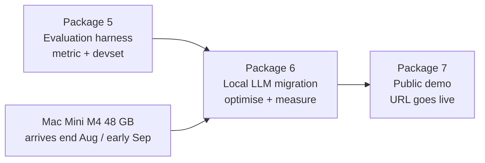
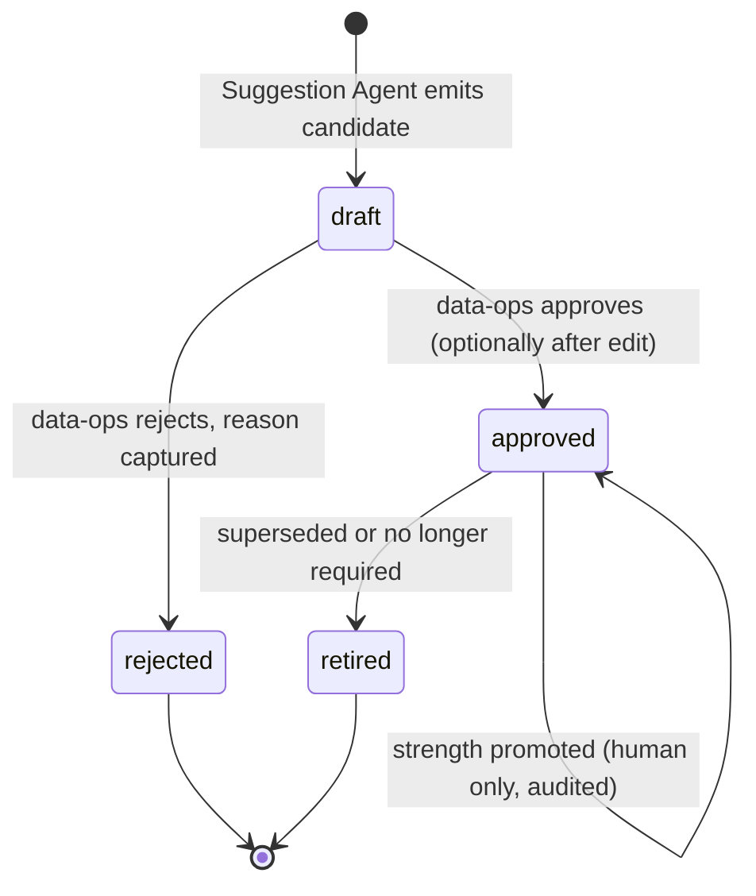
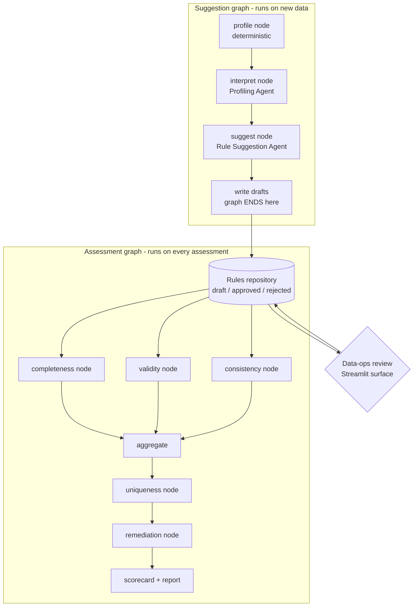
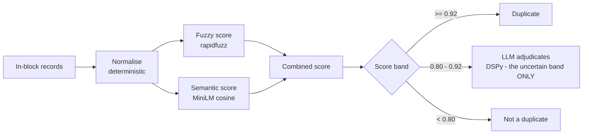

# AgentDQ - Delivery Design

```
v1.0 | 12-Jul-2026 | Initial end-to-end delivery design. Seven packages, the
                     demo architecture, the local-LLM migration, and the
                     decision tables behind each choice.
v1.1 | 12-Jul-2026 | Object onboarding: extensibility audit, object packs,
                     steward process, curated template generalisation, and the
                     two-version onboarding tool (deterministic scaffolder in
                     Pkg 2; LLM judgement layer as a Pkg 4+ stretch). Package 2
                     deliverables and build order extended accordingly.
v1.2 | 26-Jul-2026 | Scope correction: re-platforming onto SAP BDC is out of
                     scope for this POC. Portability retained as a design
                     property rather than a roadmap; Phase 2 wording removed
                     throughout.
v1.3 | 26-Jul-2026 | Package 3 (LangGraph orchestration) confirmed complete and
                     the no-checks guard added to the assessment runner; test
                     count to 84 passing, 1 skipped.
```

This document is the delivery counterpart to `agentdq-project-plan.md`. The plan
says *what AgentDQ is and why*; this says *what gets built, in what order, what
each package ships, and which design options were weighed at each step*. It is
written to be read before any further code is cut.

The organising principle: **every package ends with a system a person could
actually use, not a component that merely compiles.** That test is what decides
where the package boundaries fall, and it is the reason the Rule Suggestion Agent
is not a boundary on its own - a suggestion nobody can approve is a demo, not a
system.

---

## 1. Where the build stands

Packages 1, 2 and 3 are complete. The deterministic spine, the full agentic front
half, the approval gate, and the LangGraph orchestration exist, are tested offline
(84 passing tests, 1 skipped), and run on real SAP CAL extracts. The loop closes:
an agent suggests a rule, a human approves it, and the approved rule is loadable
and runnable by the execution layer - now orchestrated as two graphs. The first
LinkedIn article (Package 2's story - "the agent proposes, the human disposes") is
ready to write; Package 3's story ("where I put the human in the loop, and why")
follows it.

Package 3 additions (all done): src/state.py (typed graph state with reducers for
the parallel fan-out), src/graph_nodes.py (thin nodes + the two advisory
derivations), src/orchestrator.py (both StateGraphs, three-dimension parallel
fan-out), tools/run_suggestion_graph.py and tools/run_assessment_graph.py (the
graph runners), and tools/interrupt_example.py (the primitive chosen against, kept
runnable). The orchestrated assessment runs all three deterministic dimensions,
where the linear assess() ran only two.

Package 2 additions (all done): the rules repository with its lifecycle and two
backends (src/rules/repository.py), the batch suggestion runner
(tools/run_suggestion.py), the onboarding scaffolder (tools/onboard_object.py),
the two Streamlit surfaces (app/gate.py, app/bank_browser.py), and the schema
refactor that made one schema YAML the single onboarding contract per table.
The short-lived config/objects experiment was retired in favour of the schema.

The Package 1 foundation:

```
Component                        Module                                Status
-------------------------------  ------------------------------------  --------
Shared contracts / predicate IR  src/contracts.py                      done
SE16N/SE12 xlsx loader           src/data/extract_loader.py            done
Deterministic profiler           src/data/profiler.py                  done
Schema layer                     src/data/schema.py, config/schema/    done
Synthetic generator              src/data/generator.py                 done
Defect injector + labels         src/data/defect_injector.py           done
IS rule importer (107 rules)     src/rules/is_importer.py              done
Rule loader                      src/rules/rule_loader.py              done
Rule executor (pandas, Kleene)   src/rules/executor.py                 done
Completeness / Validity /        src/agents/completeness.py,           done
Consistency (execution layer)    validity.py, consistency.py
Scorecard + evaluation           src/reporting/scorecard.py            done
Streamlit dashboard (4 tabs)     app/dashboard.py                      done
Field-role vocabulary (16+1)     config/rule_bank/field_roles.yaml     done
Rule bank + retrieval join       src/rules/rule_bank.py                done
Bank builder (wraps 107 rules)   tools/build_rule_bank.py              done
Reference store (10 tables)      src/rules/reference_store.py          done
Profiling Agent (DSPy)           src/agents/profile_interpreter.py     done
Rule Suggestion Agent (DSPy)     src/agents/rule_suggester.py          done
DSPy signatures (3)              src/dspy_modules/                     done
                                 suggestion_signatures.py
```

Test position: 46 offline tests pass, no LLM or API key required. The three
deterministic dimensions score 1.000 precision and recall against injected ground
truth. All ten reference tables are extracted and loaded.

What is NOT yet built: the rules repository and approval gate, LangGraph
orchestration, the Uniqueness and Remediation agents, the evaluation harness,
the local-LLM migration, and the public demo.

---

## 2. The seven packages

```
Pkg  Ships                                    Working system at the end?
---  ---------------------------------------  --------------------------------------
1    Foundation (DONE)                        Profile real SAP data, execute rules,
                                              score against ground truth
2    Approval gate: rules repository,         Data-ops sees candidate rules with
     batch suggestion runner, two             decomposed confidence, approves /
     Streamlit surfaces                       edits / rejects, approved rules run
3    LangGraph orchestration: two graphs,     The whole loop runs as one gated
     state, advisories, execution agents      system, end to end
     read the approved repository
4    Uniqueness + Remediation agents          Duplicates surfaced and adjudicated;
                                              findings prioritised into actions
5    Evaluation: rediscovery harness,         Measured: rule-rediscovery precision
     per-agent P/R/F1, MLflow, dial and       and recall, per-agent scores, dials
     weight calibration                       and weights calibrated empirically
6    Local LLM migration + DSPy/GEPA          Same system, running on a local model,
     optimisation                             with a measured before/after
7    Public demo: Streamlit Cloud, replay     A public URL a recruiter can click
     artefacts, live toggle, sandbox gate
```

### Why the Suggestion Agent is not a package boundary

The suggester produces candidates. Candidates that cannot be approved go nowhere,
execute nothing, and change no score. Shipping the suggester alone would be a
component, not a system, and the article would be "here is an agent whose output
lands in a JSON file". Suggester plus gate together tell the one story that is the
whole thesis of AgentDQ - **the agent proposes, the human disposes** - and that
story is the centrepiece of the series. Hence Package 2 finishes what Package 1
started.

### Why migration is its own package, and why it comes after evaluation

Migrating to a local model without an evaluation harness means swapping one
unmeasured system for another and hoping. DSPy optimisers (MIPROv2, GEPA) require
a metric and a development set; the rediscovery harness in Package 5 produces
both. So the dependency is hard:



This ordering also happens to match the hardware ETA, which is convenient rather
than coincidental: there is no point having the machine earlier than the harness.

---

## 3. Package 2 - Approval gate (the immediate next build)

### 3.1 What it must deliver

```
Deliverable                      Purpose
-------------------------------  ------------------------------------------------
src/rules/repository.py          The approved-rule store and its lifecycle verbs,
                                 including add_manual_candidate() for customer-
                                 authored rules (see 9.3)
tools/run_suggestion.py          Batch runner: profile -> interpret -> suggest ->
                                 write a suggestions artefact
tools/onboard_object.py          Deterministic onboarding scaffolder + readiness
                                 checker (see 10.3); emits draft object packs
config/objects/<table>.yaml      Object packs: per-table header anchor, composite
                                 key, file pattern, uniqueness config (see 9.2)
app/ (two new surfaces)          Suggestion review (the gate, including a manual
                                 rule authoring form) and Rule Bank browser
                                 (strength governance)
Execution reads the repository   Approved rules, not raw imported YAML
```

### 3.2 Repository storage - options weighed

```
Option                        Pros                        Cons
----------------------------  --------------------------  ----------------------
A. YAML snapshot + JSONL      git-diffable and human      Two files to keep
   append-only audit ledger   readable; audit trail is    consistent (one writer
   (RECOMMENDED)              append-only by              module removes the risk)
                              construction; maps cleanly
                              onto a governed table if
                              ever re-platformed
B. Single YAML with           Simplest possible           History is rewritten in
   embedded history                                       place; merge conflicts;
                                                          a weak audit story
C. SQLite                     Transactions; concurrent    Binary blob in git, not
                              writers                     diffable; overkill for a
                                                          single-writer tool
```

**Chosen: A.** The audit story matters here more than transactional purity - this
is a governance tool, and "who approved this rule, when, and why" must be
inspectable in a pull request, not hidden in a binary.

### 3.3 The lifecycle



Every transition writes a ledger entry: rule id, from-state, to-state, actor,
timestamp, reason, and (for edits) a diff of the RuleSpec. The
`prior_strength_block` travels onto the approved rule, because governance applies
to adopted rules and not only to bank templates. **Agents never write strength**;
only a human Data Manager promotes a rule, and the promotion is audited and
reversible.

### 3.4 The repository interface (the seam everything else depends on)

```
Verb                    Effect
----------------------  --------------------------------------------------------
load_candidates()       Read the suggestions artefact produced by the batch run
approve(id, actor)      draft -> approved, ledger entry
edit_and_approve(...)   Edited RuleSpec validated against contracts, then approved
reject(id, actor,       draft -> rejected, reason captured
       reason)
retire(id, actor)       approved -> retired
promote_strength(...)   Human-only strength change, reason + note + audit trail
approved_rules()        What the execution layer runs
```

The Streamlit surfaces **render and invoke; they never decide**. All state changes
go through these verbs. This is the rule that would make a change of platform a
re-plumbing rather than a rewrite (the surface becomes some other application,
the verbs stay), and it is also what makes the interactive public demo cheap -
see 3.5.

### 3.5 Two backends behind one interface

The public demo is interactive: a visitor can approve and reject candidates
themselves. That must not corrupt the real store, nor one visitor's view corrupt
another's.

```
Backend                 Used by                 State lives in
----------------------  ----------------------  ---------------------------------
FileRepository          Real runs (your machine) Repository YAML + JSONL ledger
                                                 on disk
SessionRepository       The public demo         Streamlit session_state, per
                                                browser session, discarded on exit
```

Same verbs, two implementations. The sandbox costs one small class **because the
interface was designed for it up front**; retrofitting it later would mean
unpicking state handling from the UI.

### 3.6 Batch runner, not in-app inference

Suggestion generation is a **batch job** that writes an artefact; the dashboard
reads artefacts. This single decision satisfies three separate requirements at
once, which is a good sign it is the right shape:

```
Requirement                       How the batch runner satisfies it
--------------------------------  -----------------------------------------------
Correct approval-gate design      Suggestions are produced once, reviewed later,
                                  possibly days later. That is a batch, not a
                                  request-response.
Demo without live LLM calls       The dashboard renders REAL agent output that was
                                  pre-computed; no API key in the public app, no
                                  bill, no key to leak.
Production shape                  A scheduled job writing to a governed store is
                                  the shape this would take on any platform.
```

---

## 4. Package 3 - LangGraph orchestration

### 4.1 Two graphs, not one

They run on different cadences (suggest once per dataset; assess repeatedly), have
different autonomy profiles (one is gated, one is not), and are separated by a
human decision that can take days.



### 4.2 The gate mechanism - a revision to an earlier assumption

An earlier draft of the plan proposed LangGraph's native `interrupt` for the
approval gate. Designing the demo surfaced the flaw, and it is worth recording the
reversal honestly rather than quietly changing course.

```
Option                        Pros                        Cons
----------------------------  --------------------------  -----------------------
A. Repository-as-gate         No long-lived checkpoints;  The pause is implicit
   (RECOMMENDED)              robust across restarts and  rather than a LangGraph
   Suggestion graph ends by   redeploys; matches the      primitive
   writing drafts; assessment batch-runner design; works
   graph reads approved rules on ephemeral hosting
B. interrupt + checkpointer   Showcases the native        The checkpoint must
                              human-in-the-loop           survive a human delay of
                              primitive                   days; fragile on
                                                          ephemeral hosting; a
                                                          stale checkpoint is a
                                                          new failure mode
```

**Chosen: A**, with a small same-session `interrupt` example retained in the
codebase to demonstrate command of the primitive and the reasons for choosing
against it. A reasoned rejection is stronger evidence of judgement than naive
adoption.

### 4.3 State and cross-agent advisories

`src/state.py` holds the graph state as a TypedDict: the profile, the
characterisations, the candidates, the approved rules, the findings, the scorecard
and `upstream_advisories: dict[str, list[str]]`. Because the three dimension
agents fan out in PARALLEL, the keys several of them write - findings,
agent_results, upstream_advisories - carry reducers (list concatenation, and a
per-target merge for advisories), or LangGraph raises a concurrent-write error.

Advisories are what make the assessment graph more than a parallel fan-out. An
upstream finding dynamically modifies a downstream agent's instructions.

**As built (a routing decision the parallel fan-out forced).** The original
sketch had validity advising consistency. Parallel fan-out makes that impossible:
siblings running in the same superstep cannot advise one another, because neither
has finished when the other starts. Since the parallel fan-out was the chosen
layout, both advisories instead flow from a dimension agent to the DOWNSTREAM
uniqueness stage, where the timing is clean. This still demonstrates two
genuinely different mechanisms - which is the point, since it shows the advisory
channel is general rather than one hardcoded trick:

```
Advisory edge                Mechanism            What it does
---------------------------  -------------------  ----------------------------
completeness -> uniqueness   THRESHOLD MODIFIER   a sparsely populated compare
                             (tune a knob)        field raises the match
                                                  threshold (dedup on sparse
                                                  data is unreliable)
validity -> uniqueness       SIGNAL SUPPRESSION   a compare field with domain
                             (remove an input)    violations is dropped as a
                                                  match signal (an invalid
                                                  field is noise for matching)
```

In Package 3 uniqueness is a stub: it reads the advisories addressed to it and
logs how it WOULD adjust, so the plumbing is exercised end to end now and Package
4 only fills the stub. The same mechanism supports sequencing validity ->
consistency if that edge is ever made sequential; the parallel layout simply
routes advisories downstream instead.

### 4.4 Agents are classes; nodes are wrappers

```
Layer               Contains                            Tested how
------------------  ----------------------------------  ---------------------
Agent class         DSPy modules + deterministic logic;  Unit tests, no graph
(src/agents/*)      no LangGraph import anywhere
Node function       Thin wrapper: unpack state, call     Graph integration
(src/orchestrator)  the agent, pack the state update     tests only
State schema        TypedDict                            Trivially
```

This is why the agents built so far import nothing from LangGraph, and it must
stay that way: an agent that can only be tested by spinning up a graph is an agent
that will not be tested.

---

## 5. Package 4 - Uniqueness and Remediation

### 5.1 Uniqueness: a cost ladder, with the model last

Blocking key MTART; compared field MAKTX. Both are the MATERIAL configuration of
a generic mechanism and live in the object pack (see 9.5), not in code - EQUI
blocks on EQART and compares EQKT.EQKTX with no change to the ladder itself.



The language model is **not the matcher**. Fuzzy and semantic scoring already
match; the model is a second-pass adjudicator on the genuinely uncertain band, and
is as much a false-positive filter as a matcher ("Bearing 6203" and "Bearing 6204"
score high on both metrics and are different parts). Language-model calls scale
with genuine ambiguity, not with dataset size - that is the cost control.

Constraint for the demo: MiniLM embeddings are computed in the **batch layer** and
committed as artefacts. `sentence-transformers` must not load inside the Streamlit
app process, which is memory-constrained on the free tier.

### 5.2 Remediation

A DSPy synthesis over the aggregated findings: prioritise by business impact (a
completeness gap in a safety-relevant field outranks a formatting issue in a
search term), explain each recommendation, and cite the findings it reasons from.
It recommends; it never acts on data.

---

## 6. Package 5 - Evaluation (the package with the numbers)

This is the package that separates a portfolio project from a blog opinion, and it
must not be cut for time.

### 6.1 Two distinct evaluations

```
Evaluation             Question answered                 Ground truth source
---------------------  --------------------------------  ----------------------
Defect detection       Does the executor find the        Defect injector labels
(built in Pkg 1)       defects that were injected?       (already exist)
Rule rediscovery       Does the Suggestion Agent         The IS rules themselves,
(NEW)                  propose back the rules that       hidden in generated data
                       were hidden in the data?
```

The rediscovery harness is the novel one: generate data that conforms to a known
embedded rule, hand it to the Suggestion Agent, and measure whether the rule comes
back. It yields **retrieval recall** (did the bank surface the right template?) and
**suggestion precision** (did the adjudicator accept the right ones?), which is
exactly the pair the two-dial design needs in order to be calibrated rather than
guessed.

### 6.2 What gets calibrated

The defaults declared during the build are placeholders awaiting measurement, and
should be named as such:

```
Parameter                     Current default   Calibrated by
----------------------------  ----------------  --------------------------------
Retrieval floor (recall)      0.80              Rediscovery recall at retrieval
Highlight floor (precision)   0.95              Suggestion precision at the gate
Confidence weights            0.4 / 0.4 / 0.2   Correlation of the confidence
w_prior / w_support /                           breakdown against rediscovery
w_coverage                                      correctness
```

Confidence remains decomposable arithmetic over three declared inputs:

$$\text{confidence} = w_p \cdot s_{\text{prior}} + w_s \cdot s_{\text{support}} + w_c \cdot s_{\text{coverage}}, \qquad w_p + w_s + w_c = 1$$

The point of calibration is that the weights stop being an assertion and start
being a measurement.

### 6.3 MLflow

Per-agent, per-dimension, per-scenario precision, recall and F1; rediscovery
scores; dataset versions; and the baseline-versus-optimised comparison runs that
Package 6 depends on. LangSmith is complementary for development-time LLM trace
inspection.

---

## 7. Package 6 - Local LLM migration

### 7.1 Why this is possible at all without a rewrite

Because no prompt was ever a string. Every LLM step is a DSPy signature, so the
backend swap is a configuration change:

```
dspy.configure(lm=dspy.LM("openai/<model>"))          # before
dspy.configure(lm=dspy.LM("ollama_chat/<model>"))     # after
```

That is the whole migration, mechanically. The work in this package is not the
swap; it is **measuring and closing the quality gap**.

### 7.2 Serving options on the Mac Mini M4 (48 GB)

```
Option        Pros                            Cons
------------  ------------------------------  ------------------------------
Ollama        Simplest; OpenAI-compatible     Less control over sampling and
(RECOMMENDED) endpoint; trivial DSPy config;  quantisation detail
              easy model swapping
LM Studio     GUI, same API surface           Desktop-oriented; less natural
                                              for a headless service
llama.cpp     Maximum control over            More operational overhead
server        quantisation and sampling
```

Model class: a 30B-parameter-class model at 4- or 5-bit quantisation is the
sensible target for 48 GB, leaving headroom for embeddings and the OS. A 70B at
4-bit will fit but leaves little room and will be slow. The specific model should
be chosen at the time on current evidence, not pre-committed here.

### 7.3 Optimisation

```
Stage        Tool                    What it does
-----------  ----------------------  ----------------------------------------
Baseline     none                    Local model, unoptimised. The honest
                                     starting number.
Optimise     DSPy MIPROv2            Instruction and few-shot optimisation
                                     against the rediscovery metric
Optimise     DSPy GEPA               Reflective prompt evolution. Note: GEPA
                                     uses a REFLECTION model to evolve prompts
                                     - a frontier model can reflect while the
                                     TARGET model stays local. Legitimate, and
                                     a good story.
Report       MLflow                  Frontier vs local, baseline vs optimised
```

### 7.4 The known limitation, designed for

Smaller local models are less reliable at structured output than frontier models.
The architecture already contains the mitigation: every agent output is validated
against `contracts.py` and a malformed suggestion is **dropped, not passed on**.
So the failure mode of a weaker model is *fewer suggestions*, not *corrupt
suggestions*. That is the right failure mode, and it was designed in before it was
needed.

---

## 8. Package 7 - The public demo

### 8.1 Data strategy

```
Dataset                        Role                            In public repo?
-----------------------------  ------------------------------  ---------------
SAP CAL extracts (public       Authenticity - real SAP master  YES, column-
golden image, cal.sap.com)     data distributions              trimmed, with a
                                                               provenance note
Synthetic + injected defects   Ground truth - lets the         YES
                               scorecard show precision and
                               recall, not merely findings
Internal demo system           Private testing only            NO. Never.
MARA / MARC / MAKT
```

The combination is stronger than either alone: CAL data proves the system handles
real SAP shapes; the synthetic layer proves it *catches known dirt*, because only
there does ground truth exist. A `config/datasets.yaml` seam selects the dataset,
so the same code runs on public data in the demo and private data on your machine.

### 8.2 Demo modes

```
Mode                    Default?   LLM             Availability
----------------------  ---------  --------------  --------------------------
Artefact replay         YES        None            Always up. The dashboard
                                                   renders PRE-COMPUTED, REAL
                                                   agent output.
Live inference toggle   No         Mac Mini via    Best-effort. Degrades to
                                   secure tunnel   replay with a banner when
                                                   the tunnel is down.
```

The critical property: **the interactive approval gate needs no LLM at all.**
Approving and rejecting candidates is state manipulation. So the demo's headline
feature - a recruiter clicking "approve" on an agent's suggestion and watching the
rule take effect - is always available, regardless of whether the Mac Mini is
awake.

A "how this was generated" panel states plainly that the suggestions are real
agent output, replayed - not faked, and not live.

### 8.3 Why the demo must not depend on the Mac Mini

A public URL whose availability depends on a machine at home, an ISP, a tunnel and
a model load is a URL that will be dead exactly when a hiring manager clicks it. A
dead demo is worse than no demo. Hence replay-by-default, live-as-a-bonus.

### 8.4 Hosting

Streamlit Community Cloud (free), deploying from the public GitHub repo. Known
constraints: limited memory on the free tier (hence no embeddings or inference in
the app process), and apps sleep after inactivity (the first visitor incurs a wake
delay of some seconds). Both are acceptable; neither is fatal.

---

## 9. Onboarding new objects (EQUI, IFLOT, and beyond)

AgentDQ must not be a material-master tool that happens to have generic
machinery; onboarding a new object class (equipment, functional locations,
vendors) must be configuration, not code. This section records the extensibility
audit, the steward's onboarding process, and the design changes it forces.

### 9.1 The extensibility audit

```
Component                    Object-agnostic today?   The catch
---------------------------  -----------------------  -----------------------------
extract_loader               YES                      needs a header_anchor per
                                                      table (EQUNR, not MATNR)
profiler                     MOSTLY                   TABLE_HEADER_ANCHOR and
                                                      TABLE_PRIMARY_KEY are
                                                      hardcoded dicts for material
                                                      tables; the code's own
                                                      comments anticipate migrating
                                                      them to config
schema layer                 YES                      new YAMLs per table
field_roles.yaml             MECHANISM yes,           vocabulary is material-
                             CONTENT no               centric; equipment needs new
                                                      roles, added by a human (the
                                                      designed extension mechanism)
rule bank retrieval          YES                      joins on table + role
templates (107 wrapped)      NO                       all bound to MARA/MARC/MAKT;
                                                      cross-object reuse needs
                                                      curated generalisation (9.4)
reference store              YES                      manifest is config; several
                                                      tables are REUSED (T001W,
                                                      T002)
profile interpreter          YES                      reads profile + roles only
rule suggester               YES                      both engines table-agnostic
executor                     YES                      generic over RuleSpec IR
uniqueness (Pkg 4 design)    NO                       MTART blocking / MAKTX
                                                      compare must become
                                                      per-object config (9.2)
generator / injector         NO                       material-specific; affects
                                                      the EVALUATION path only,
                                                      not live assessment (9.6)
```

The headline: the agentic core needs zero code changes to onboard EQUI. The work
is configuration seams.

### 9.2 Object packs - the new configuration seam

One YAML per table under `config/objects/`, carrying everything the pipeline
needs to know about a table:

```
Object pack field         Example (EQKT)              Consumed by
------------------------  --------------------------  -----------------------
table                     EQKT                        everything
header_anchor             EQUNR                       extract_loader
primary_key               [EQUNR, SPRAS]              profiler key check
file_pattern              EQKT_EX_DATA.xlsx           profiler / batch runner
uniqueness                blocking_key, compare_      Uniqueness agent (Pkg 4)
                          fields (per object)
```

The profiler's two hardcoded dicts become fallbacks behind a config read - the
v0.4 change its own comments already anticipated. This is the single most
important extensibility change: it converts "onboarding = edit Python" into
"onboarding = add config".

### 9.3 The steward's onboarding process

```
Step  Actor      Action                                Artefact produced
----  ---------  ------------------------------------  --------------------------
1     Steward    Extract data (SE16N xlsx) and check   EQUI/EQKT/IFLOT xlsx,
                 tables (SE12): e.g. T370K technical   reference xlsx
                 object types, T024I planner groups.
                 Several references are REUSED: T001W
                 (IWERK/SWERK), T002 (SPRAS)
2     Steward    Register the object: run the          config/objects/equi.yaml
                 scaffolder (10.3), review the draft   etc. (confirmed by human)
                 object pack, confirm
3     Steward    Extend the role vocabulary with NEW   config/rule_bank/
                 roles (equipment_identifier,          field_roles.yaml
                 equipment_category, technical_
                 object_type, functional_location_
                 identifier). REUSED roles need
                 nothing: GEWEI -> unit_of_measure,
                 IWERK -> org_unit_plant, EQKTX ->
                 description_text
4     Steward    Add new reference tables to the       config/reference/
                 manifest, drop extracts, flip status  manifest.yaml
5     Steward    Run the profiler                      data/profile/EQUI_profile
                                                       .json etc.
6     Steward    Run the batch suggestion runner.      suggestions artefact
                 Roles route fields: generalised
                 templates fire by ROLE (a unit rule
                 matches GEWEI though no equipment IS
                 rule ever existed); unknown fields
                 route to inference
7     Steward    Review in the approval gate: approve  repository - approved
                 / edit / reject candidates, AND        rules + ledger entries
                 author customer-specific rules
8     System     Assessment graph runs the dimensions  scorecard per object
                 with approved rules; uniqueness reads
                 its per-object config
```

Step 7 carries a governance property worth stating in bold: **customer-specific
rules enter through the same gate as agent suggestions.** Same contracts
validation, same draft -> approved lifecycle, same ledger, same strength
governance. No side door. A hand-authored rule is a draft with
`provenance.source=customer_authored` and a default strength of `unverified`,
promotable by the steward with a reason. Every rule in the repository, whoever
wrote it, has a recorded origin and an approval trail.

Step 6 is the design bet paying off: equipment has no IS rules workbook, yet the
suggester still produces bank-matched candidates via role generalisation, plus
inferred ones for the novel fields. This is precisely the non-SAP-rules scenario
the rule bank was designed for; onboarding EQUI end-to-end validates the central
architectural claim.

### 9.4 Template generalisation - a curated decision, not an automatic one

The binding schema supports `target_table: ANY` + role, but the bank builder
correctly binds every imported template to its source table (an IS rule written
for MARA is a MARA rule). Cross-object reuse therefore needs a decision about
WHICH templates generalise:

```
Option                          Pros                    Cons
------------------------------  ----------------------  ------------------------
A. Steward curates: promote     Deliberate; audited; a  Manual effort per
   selected templates to ANY +  MEINS rule generalising template (in practice
   role in the bank YAML        to GEWEI is a           only the reference-
   (CHOSEN)                     governance decision     domain handful is worth
                                                        generalising)
B. Builder auto-generalises     Zero effort             A table-specific quirk
   every reference-domain rule                          silently becomes a
                                                        universal rule - the
                                                        overfitting trap in a
                                                        new costume
```

**Chosen: A.** Generalisation is a curated, human decision, consistent with the
rest of the governance story. Realistically only the reference-domain templates
(units, languages, plants) earn promotion to `ANY`.

### 9.5 Uniqueness becomes per-object configuration

The Package 4 design (MTART blocking, MAKTX compare) is the MATERIAL
configuration of a generic mechanism, not the mechanism itself. The object pack
carries `uniqueness.blocking_key` and `uniqueness.compare_fields`; EQUI would
block on EQART and compare EQKT.EQKTX. No change to the cost-ladder design -
only to where its parameters live.

### 9.6 Limitation stated plainly: evaluation coverage

The generator and defect injector are material-specific. Live assessment of a
newly onboarded object works fully; ground-truth REDISCOVERY evaluation
(Package 5) initially covers material objects only. Extending the generator to
equipment is deliberately out of scope for now - the evaluation harness proves
the method on materials; the live pipeline proves extensibility on equipment.

---

## 10. An onboarding agent - feasibility, effort, and the two-version plan

Should onboarding itself be agentic - an agent that takes sample data, infers
structure and keys, and writes the object pack? Feasible and useful, but not as
a free-roaming agent, and not in version 1. Applying the project's own test
(the LLM earns its place only where judgement is irreducible) decomposes the
task:

### 10.1 What onboarding actually consists of

```
Onboarding step                    Nature                     LLM needed?
---------------------------------  -------------------------  ------------------
Find the header row                deterministic scan         NO (extract_loader
                                                              already does it)
Read column names                  deterministic              NO
Detect the composite key           MOSTLY deterministic:      Mostly NO -
                                   search column combinations uniqueness over
                                   whose distinct count       combinations is
                                   equals row count           arithmetic
Propose header_anchor              trivial                    NO
Identify what the table IS         judgement over evidence    YES - irreducible
("equipment master keyed on        plus SAP domain knowledge
EQUNR")
Map fields to roles / propose      judgement                  YES - and ALREADY
new roles                                                     BUILT (the Profile
                                                              Interpreter)
Write the object-pack YAML         mechanical templating      NO
Approve the object pack            governance                 NO - HUMAN
```

Most of the work is deterministic. The LLM-shaped core is small, and half of it
already exists.

Key detection deserves one note, since it is the step people assume needs AI: it
does not, mostly. Candidate-key search is arithmetic; the residual ambiguity (a
coincidentally unique column such as a timestamp masquerading as a key, or a
legitimately duplicated key in dirty data) is worth an LLM sanity-check - "does
EQUNR+SPRAS make sense as the business key of what appears to be a text table?"
- but the search itself is code. The same cost-ladder shape as the Uniqueness
agent: deterministic narrows, the model adjudicates the residue.

### 10.2 Effort and the autonomy boundary

```
Version                        Effort          What you get
-----------------------------  --------------  --------------------------------
v1: onboard_object.py as a     ~1 day on top   Scaffold command: reads the xlsx,
deterministic SCAFFOLDER       of the planned  detects header + key candidates,
(no LLM)                       checker         maps fields via role sap_examples,
                                               EMITS A DRAFT object pack with
                                               TODO markers; steward edits and
                                               confirms
v2: add the judgement layer    ~2-3 days       One new DSPy signature (table
(LLM adjudication of key and                   identification + key sanity
table identity; reuse the                      check); draft arrives mostly
interpreter for roles)                         filled; steward mostly confirms
v2 as a free-roaming agent     More, for       NOT RECOMMENDED. Object packs are
writing config directly        less            governance artefacts - they
                                               determine what gets profiled,
                                               keyed and assessed. An agent
                                               writing them unsupervised is the
                                               same category error as an agent
                                               promoting its own rule strength.
```

The correct shape in both versions is **agent drafts -> human confirms** - the
approval-gate pattern applied to onboarding.

### 10.3 The chosen sequence

```
Package     Deliverable
----------  -------------------------------------------------------------
Package 2   v1 scaffolder: tools/onboard_object.py (absorbs the readiness
            checker into one command: scaffold + validate). Deterministic,
            ~1 day, and it forces the object-pack schema and the
            draft-confirm flow to exist.
Package 4+  v2 judgement layer as an OPTIONAL stretch: one new DSPy
(stretch)   signature, interpreter reuse, same draft-confirm flow. Slots
            in cleanly BECAUSE v1 built the rails. Explicitly yields to
            Package 5 if time tightens - evaluation must not lose to a
            convenience feature.
```

The v1 scaffolder already removes most of the steward's friction (nobody enjoys
hand-typing key columns into YAML), and the build order mirrors how the
suggester itself was built: rails first, judgement second. That parallel -
"I built the deterministic scaffolder first and added the LLM only where field-
role and key judgement genuinely needed it" - is itself part of the earned-
agentic-framing story the article series carries.

---

## 11. Constraints and limitations, stated plainly

```
Constraint                        Consequence / mitigation
--------------------------------  ---------------------------------------------
Streamlit Cloud free tier is      No sentence-transformers or LLM inference in
memory-limited                    the app process; all heavy work is batch, and
                                  the app reads artefacts
Streamlit apps sleep              First visitor waits a few seconds for wake
Live toggle is best-effort        Treated as a bonus, never the default path;
                                  graceful degradation with a banner
Local model quality gap           Expect a measurable gap before optimisation.
                                  The honest posture is to publish the gap, then
                                  publish the optimised gap.
Sandbox approvals are per-        A visitor's decisions vanish on refresh. This
session and in-memory             is a feature (no shared corruption); the UI
                                  should say so.
Scoped reference tables (T024D)   Bank matches against plant-scoped tables are
                                  deferred; values() returns None without a
                                  scope key, by deliberate conservatism
Match rate is over DISTINCT       Good for deciding whether to suggest; it is a
values, not row-weighted          different number from the executor's row-level
                                  pass rate. Do not conflate them in the UI.
Generator / injector are          Rediscovery evaluation (Pkg 5) initially covers
material-specific                 material objects only; live assessment of newly
                                  onboarded objects is unaffected (see 9.6)
Series cadence is a commitment    Packages are sized so each fortnight's material
                                  already exists when writing begins
```

---

## 12. Suggestion-quality backlog (from Package 2 review)

Reviewing the first real MARA suggestion run surfaced two distinct issues. They
are recorded here, not fixed now, because both are better addressed once Package
5 gives us a way to MEASURE "better" rather than judge it by eye. Naming them
apart matters: they are not the same kind of problem, and conflating them would
send effort at the wrong target.

```
Observation from review           Nature                    Where it is fixed
--------------------------------  ------------------------  -------------------------
Inference proposes not-null on    Grounding / redundancy.   Deterministic guard in
MATNR, MTART - trivially true     The schema ALREADY knows  the suggester (small):
for S/4 data, so worthless        the field is a key or     do not run inference for
                                  mandatory; the rule adds  not-null on a field the
                                  no information            schema declares key or
                                                            mandatory. Package 5.
Wanted: association rules         Capability gap. The       New archetypes + new
(MTART -> allowed MATKL) and      engine can only emit      inference signatures,
text-derived rules (MATKL from    not_null and domain_in;   likely a new evidence
a phrase in MAKTX)                these shapes cannot be    source (co-occurrence
                                  expressed at all         stats). A FEATURE, post-
                                                            Package 6, evaluated
                                                            against the harness.
```

Two principles this backlog encodes:

1. **"Smarter" needs a metric before it needs a prompt.** Tuning the suggestion
   agent before the rediscovery harness (Package 5) exists means optimising
   against subjective impressions of one run. After Package 5 it means
   optimising against precision and recall. The design already orders migration
   after evaluation for this reason; the same logic governs any suggester
   improvement.

2. **Rejections are the first drops of a devset.** Every reject-with-reason at
   the gate is a labelled negative in the repository ledger. When Package 5/6
   arrives, "the steward rejected these" becomes a real evaluation signal and a
   candidate GEPA optimisation target. The review work already done is not
   throwaway; it is the beginning of the training data.

The redundant-mandatory guard is the one item that could be pulled forward if
the volume of trivial suggestions ever made the gate unusable (an unusable gate
blocks testing of the rest of the pipeline). At Package 2 review the volume was
manageable, so it stays in Package 5.

---

## 13. The article series

One article per package, published as the package lands. The series is the point:
the differentiator is not "I used LangGraph" - it is the judgement behind each
decision, and judgement needs the room a series gives it.

```
Pkg  Working title                                    The idea it carries
---  ----------------------------------------------  ---------------------------
1    Why I deleted my rules engine                    The pivot: a deterministic
                                                      engine with an LLM bolted on
                                                      is not an agentic system
2    An agent that suggests rules, and a human        Autonomy placed deliberately;
     who says no                                      the gate as a control, not
                                                      bureaucracy
3    Where I put the human in the loop, and why       Two graphs; why I chose
                                                      against LangGraph interrupt
4    The LLM as a false-positive filter               Cost ladder; the model judges
                                                      only genuine ambiguity
5    Did the agent rediscover the rules I hid?        NUMBERS. Rediscovery
                                                      precision and recall.
6    Frontier API versus a model on my desk,          NUMBERS. Baseline vs MIPROv2
     measured                                         vs GEPA, local vs frontier.
7    Ship it: a portfolio you can click               The live URL
```

Packages 5 and 6 are the two strongest technical posts, precisely because they
contain measurements. Very few people writing about agents or local models publish
a precision and recall table. Guard those two packages.

---

## 14. Immediate next step

Packages 1 to 3 are complete. The next build is Package 4 (Uniqueness and
Remediation); its design is in section 5. Package 4 fills the uniqueness stub the
orchestration already wires - the two cross-agent advisories (threshold modifier,
signal suppression) that currently reach a logging stub will start actually
modifying the matcher's behaviour, and the Remediation agent turns the merged
findings into prioritised actions.

At the end of Package 2 the loop closed for the first time: an agent suggests a
rule, a human approves it, and the approved rule runs and changes the score.
